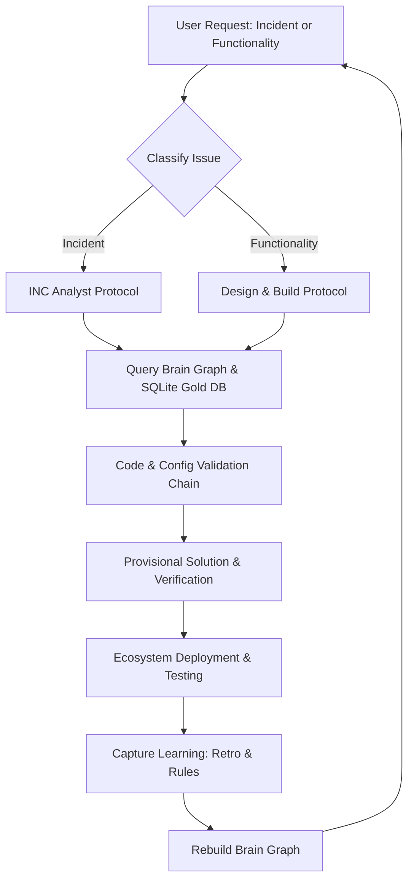

# Project Evaluation & Specification Report: UNESCO SAP Intelligence Platform

This document is the canonical reference point for the UNESCO SAP Intelligence Platform's architecture, Way of Working (WoW), and style guidelines. It must be read by all incoming agents before starting work.

---

## 1. Technical Architecture & Capability Layers

The system is organized around a **Two-Tier Model** that separates reusable knowledge from script execution:
*   **Tier 1: Skills & Frameworks** (`.claude/skills/` and `lib/`): Self-contained modules that define system patterns (e.g., house bank configuration, transport intelligence, BDC parsing, bank statement reconciliation).
*   **Tier 2: Execution** (`Zagentexecution/`): Scripts (228+) that import and consume Tier 1 skills to run operations, extractions, or diagnostics. Execution scripts do not define patterns; skills do.

### The 11 Capability Layers
The platform operates across 11 interconnected layers, each feeding the next:
```
┌─────────────────────────────────────────────────────────────┐
│ L11: Integration Intel   → Mapped partner profiles & IDocs  │
│ L10: BDC Intelligence    → SM35 session forensics & parsers  │
│ L9:  Class Deployment    → Automated ABAP class compiler    │
│ L8:  System Monitoring   → Real-time SM04/SM37/ST22 status  │
│ L7:  Process Intel       → Signavio-style DFG mining maps   │
│ L6:  Fiori Development   → React/UI5 web component clones   │
│ L5:  Transport Intel     → E070/E071 CTS forensics          │
│ L4:  Code Extraction     → ADT API + RFC code readers       │
│ L3:  Validation/Domain   → 3-level brain/graph registry     │
│ L2:  Data Extraction     → 2.5GB SQLite gold database       │
│ L1:  SAP Connectivity    → SNC/SSO (P01) & basic auth (D01) │
└─────────────────────────────────────────────────────────────┘
```

### The Three-Pillar Tool Stack
1.  **Python RFC (`pyrfc` + ConnectionGuard)**: Used for reading tables, background jobs, BDC logs, active users, and system dumps. P01 is read passwordless via SNC/SSO; D01 uses password auth.
2.  **ADT REST API (`sap_adt_client.py`)**: Used to read, write, and activate ABAP source code (classes, programs, BSP) on D01.
3.  **Fiori Tools CLI**: Used for scaffolding replacement Fiori apps in local workspaces.

---

## 2. The Way of Working (WoW)

The core engine of this project is a **continuous learning loop** driven by issue intake, domain-scoped analysis, knowledge graph queries, and post-verification learning injection.



### A. Domain-Driven Incremental Knowledge
The system is partitioned into core business areas defined in the Domain Registry (`brain_v2/domains/domains.json`):
*   **Treasury & BCM**: House bank configuration, electronic bank statement (EBS) importing, dual-control validation workflow `90000003`, and signatory responsibility groups.
*   **Financial Accounting (FI)**: GL master data, posting rules, and validation/substitution exit chains (`YRGGBS00`).
*   **Public Sector Management (PSM)**: Funds, fund centers, budget lines, and the budget rate custom solution.
*   **Human Capital Management (HCM)**: Employee lifecycle, infotypes, payroll postings, and Fiori apps.

Every domain has a **3-Axis Taxonomy**:
1.  *Functional*: The business domain (e.g., BCM, Treasury).
2.  *Module*: The SAP module codes involved (FI, CO, FM, HCM, etc.).
3.  *Process*: The UNESCO process lifecycle (e.g., Budget-to-Report [B2R], Hire-to-Retire [H2R], Procure-to-Pay [P2P], Travel-to-Claim [T2R], Project-to-Close [P2D]).

### B. Relational Graph & The "Neural Network"
The "Neural Network" of the project is a massive, multi-layer relationship graph managed via `brain_v2/` (55,334 nodes and 115,416 edges). The graph relates:
*   **Code Objects**: ABAP Classes, BSP apps, standard programs, enhancement points.
*   **Configuration**: DMEE XML trees, house bank records, validation steps, substitution rules.
*   **Master Data**: Over 54,000 individual funds, fund centers, and company codes.
*   **Operational Context**: Transports, background jobs, active RFC destinations.
*   **Intelligence Artifacts**: Incidents, claims, rules, and skills.

The graph enables the agent to execute complex impact and dependency traversals:
*   *Dependency Tracing*: "What code objects, tables, and config parameters does this class depend on?"
*   *Impact Analysis*: "If we modify G/L account symbol configuration or a substitution exit, what downstream processes, transactions, and user groups are impacted?"

### C. Issue Classification Loop
When you introduce a new problem or ticket, the workflow branches based on classification:

#### 1. Incidents (Defect/Failure Triaging)
Incidents (e.g., `INC-000006906` Maputo timeout, `INC-000006073` Travel posting error) are triaged using a strict forensic format stored in `brain_v2/incidents/incidents.json`:
*   **Verbatim Intake & Term Translation**: Standardizing user descriptions into precise SAP field terminology (e.g., "bank download failure" translated to `YTR3` transaction executing `YTBAE002` BDC wrapper).
*   **Code Validation Chain**: Tracing the exact sequence of code lines and execution logic that caused the dump (e.g., `YTBAE002.abap:27 GC_MOD='E'`).
*   **Multi-Tier Evidence**: Claims and findings must designate their evidence tier:
    *   *TIER_1*: Source code + production database state (e.g., actual database rows or code execution).
    *   *TIER_2*: Empirical validation (e.g., reproducing behavior in sandbox or local environments).
    *   *TIER_3*: Inferred reasoning.
*   **Fix Path**: Mapping tactical (immediate workaround), corrective (transported code/config change), and preventive (automated QA checkers) resolutions.

#### 2. New Functionality (Development & Configurations)
For new requests, the platform relies on automated code deployment and master data sync:
*   **P01 → D01 Master Data Sync**: Using `sap_master_data_sync` to align G/L account master tables (`SKA1`/`SKB1`/`SKAT`) and hierarchies across systems, followed by `sap_account_comparison` to detect configuration drift.
*   **Code Scaffolding**: Constructing Fiori elements apps or building custom ABAP helper classes using ADT REST APIs on D01.

### D. The Learning Ingestion & Brain Rebuild Loop
Once an issue is resolved or a new functionality is deployed:
1.  **Challenging Assumptions (Principle 8)**: The agent must identify at least one unvetted assumption and verify it directly against P01 data.
2.  **Capturing Learnings**: Lessons are extracted and documented inside the session retro file (`session_NNN_retro.md`) and written directly as new, machine-readable rules in `brain_v2/agent_rules/feedback_rules.json`.
3.  **Updating Skills**: Relevant skill files (`SKILL.md` documents) are updated with new tables, bugs, and known failures to prevent future agents from repeating the same mistakes.
4.  **Rebuilding the Graph**: Running `rebuild_all.py` executes a 4-step pipeline:
    *   Recompiles the NetworkX graph.
    *   Updates active SQLite databases.
    *   Regenerates `brain_state.json`.
    *   Injects markdown links to establish bidirectionality between files and graph nodes.

---

## 3. The Three Constitutional Principles

To guarantee system stability, the platform is governed by three core principles at Layer 0 of `brain_state.json`:

1.  **CP-001: Knowledge over Velocity**: Never sacrifice traceability or evidence for speed. Losing context is irreversible; being slow is reversible. Resisting the urge to compile summaries that drop causal links, paths, or code lines.
2.  **CP-002: Preserve first, context is cheap**: Do not perform lossy prose compression at storage time. Leverage the large context window by storing detailed structured records (e.g., typed lists, specific schemas) instead of summarizing text.
3.  **CP-003: Precision, evidence, facts**: Every claim or decision must carry a precise citable anchor (file paths, line numbers, or database keys) and an explicit evidence tier. Approximations (e.g., saying "~30 users" instead of "11 users") are treated as defects.

---

## 4. Active Backlog & Next Steps

Based on `.agents/intelligence/PMO_BRAIN.md`, here are the active high-priority items currently pending:

*   **H50 (Triage 71 Brain Blind Spots)**: Classifying the 71 missing nodes in the graph to restore brain coverage to $\ge 80\%$.
*   **H53 (Transport D01K9B0F72 Audit)**: Conducting an audit of I_KONAKOV's customizing transport to determine if "HR COBL BAPI enhancement" introduces structural field appends to `CI_COBL` (which affects G/L tables and intercompany reporting) or simple master config updates.
*   **H54 (YTBAE002 Maputo Fix Rollout)**: Preparing the Transport of Copies for the Maputo `YTR3` timeout fix (`GC_MOD` 'E' $\rightarrow$ 'N' at `YTBAE002.abap:27`) to deploy to P01 and monitoring ST22.
*   **H55 (STAD Trace on Dormant Programs)**: Tracing interactive usage of `YTR1`, `YTR2`, and `YTR2_HR` to confirm if they can be decommissioned or if they require the same Maputo-style BDC mode fix.
*   **H56 (YCL_FI_BANK_RECONCILIATION_BL Extraction)**: Extracting the backing class for `YFI_BANK1` to determine how it integrates with or replaces the `YTR3` execution logic.

### Suggested System Improvements
1.  **Automation of the 7-Check AGI Verification Pass**: Build `scripts/validate_verification_pass.py` to auto-scan session retros for forbidden self-congratulation phrases, unclosed predictions, and broken anchors before commits are allowed.
2.  **Auto-Synchronization of Brain Graph (Git Hooks)**: Implement a Git pre-commit hook that automatically runs `python brain_v2/rebuild_all.py` on commit if files in `knowledge/`, `brain_v2/`, or `.agents/` are modified.
3.  **ADT API Client XML Modernization**: Complete the refactoring of `sap_adt_client.py`'s lock, activation, and check endpoints to use `xml.etree.ElementTree` order-independent parsing and raise strict custom exceptions on HTTP failures.
4.  **Interactive Diagram Scaffolder**: Create `scripts/scaffold_diagram.py` to automatically lay out CSS/SVG nodes in a wrapped zigzag pattern given a JSON node map.

---

## 5. Claude Interaction Forensics & User Style

Through forensic analysis of historical conversation logs, the unique communication style and procedural constraints of the UNESCO SAP Intelligence Platform have been codified:

### A. Bilingual Switching (Spanish / English)
Prompting is dynamically hybrid. Technical concepts, SAP modules, and configuration elements are preserved in English, while session management commands, immediate feedback, and course corrections switch naturally to Spanish:
*   **Session controls:** *"Nueva session. Protocolo de paertura"* (Opening protocol) and *"cerremos la session"* or *"close session and do retrospective"*.
*   **Quick commands:** *"HOLA PODEMOS HACER EL COMMIT DE LO QUE TENEMOS PENDINETE"*, *"nada"*, and *"que falta"*.
*   **Context switching:** *"vamos a volver a trabajar sobre company code Copy STEM"*.

### B. Anti-Speculation & Rigor ("No Inventes")
There is a strict zero-tolerance policy for hallucinated logic or writing programs from scratch ("De 0"). The agent is expected to extract, analyze, and adapt existing standard/custom SAP program logic (e.g., `SAPFPAYM` wrapper code) rather than speculative engineering:
*   *Verbatim Warning:* *"por favor no inventes mas. me pones en riosgeo"* (Please do not invent anymore. You put me at risk).
*   *Verbatim Command:* *"FPAYH/FPAYHX/FPAYP/FPAYPX ( son esttucturas... tendrias que tomar el codigo original de los progmasa que te pase y adaptarlo. No inventes... De 0, remover los checks, no inventes extrae SAPFPAYM y todo lo relacionado"*.

### C. Evidence-Based Validation (Tier-1 Over User Interpretation)
All findings and system mapping must prioritize actual system configuration and database tables (BKPF, T036FT, FMFINCODE, PROJ, PRPS, etc.) over user-provided summaries or spreadsheets:
*   *Verbatim Rule:* *"Remember that the excel passed is just an user interpretation we must base our conclusion in data SAP system and SAP and bank informations"*.
*   *System validation check:* *"did you check against golden or D01?"* and *"Esta informacion deberia estan en golden DB"*.

### D. The AGI Verification Pass (The 7-Check Drill)
To prevent self-congratulation, single-source claims, or context drift, a mandatory verification drill is executed before any persistent write or session close (originally defined in `C:\Users\jp_lopez\\.claude\skills\agi-verification-pass`):
1.  **Check 1 (Agent Spot Checks):** Verifying 2 claims from any parallel agent against source page verbatim.
2.  **Check 2 (Source Authority Sanity):** Demoting or flagging stale sources (>12 months old).
3.  **Check 3 (Contradiction Scan):** Grepping prior topic files and aborting if zero contradictions are found (zero contradictions implies insufficient research depth).
4.  **Check 4 (Single-Source Audit):** Demoting single-source claims to TIER_3.
5.  **Check 5 (Prediction Closure):** Closing predictions via `falsification_log.md` to capture valuable negative lessons.
6.  **Check 6 (Parent-Tree Walk):** Ensuring scope claims ("all", "every") are backed by reading at least 50% of the target directory/hierarchy.
7.  **Check 7 (Forbidden Pattern Audit):** Eliminating self-congratulatory language (*"best session"*, *"highest yield"*) or unverified declarations of confirmation.

### E. Design and Formatting Preferences
Visual diagrams must follow premium interface design standards (dark theme, neon accents, orthogonal 90° connections) with exact styling dimensions to avoid horizontal page overflow:
*   *Verbatim Layout Rule:* *"Use a multi-row layout (zigzag/snake) to wrap nodes"* so the diagram fits the screen without scrolling.
*   *Verbatim Dimension Rule:* *"Node dimensions: Every node: width: 180, height: 80, Font size inside nodes: 15px, white, bold, text-align: center"*.

---
### AI Diligence Statement
| Field | Value |
|-------|-------|
| AI Role | Permanent reference specification detailing core capability layers, WoW, rules, backlog, and forensics for future sessions. |
| Model | Antigravity (Gemini) |
| Human Role | JP Lopez approved the structure, improvements list, and WoW grounding guidelines. |
| Verification | Extracted from verified session logs and repository structure. |
| Accountability | JP Lopez maintains full responsibility. |
