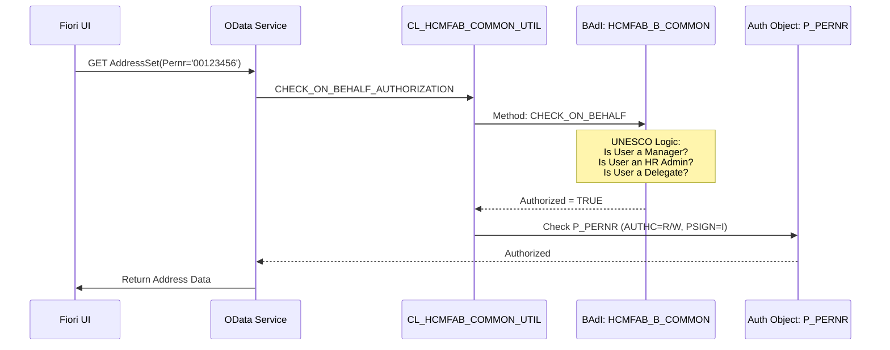

# [Fiori Analysis] HCM Manage Address Data (UNESCO)
> **Artifact Type**: Fiori App Analysis (UI Blueprint, Logic & On-Behalf Mechanism)

---

# PART I: APPLICATION LANDSCAPE

## 1. Functional Overview
The **Manage Address Data** app (Semantic Object: `Employee`, Action: `manageAddressData`) allows employees, managers, or HR admins to maintain address Information.
- **ESS Mode (Self)**: Users manage their own addresses.
- **MSS/Admin Mode (On Behalf)**: Authorized users manage addresses for others.

## 2. Technical Componentry

| Object | Type | Role |
| :--- | :--- | :--- |
| `HCM_ADDR_MAN` | SAP Fiori App | Standard UI Component (App ID `F3004`). |
| `Z_HCMFAB_ADDRESS_SRV` | OData Service | UNESCO Redefinition of standard `HCMFAB_ADDRESS_SRV`. |
| `CL_HCMFAB_ADDRESS_DPC_EXT` | ABAP Class | Data Provider logic (Redefined to inject UNESCO rules). |
| `HCMFAB_B_COMMON` | BAdI | **The Gateway**: Determines if "On Behalf" is authorized. |
| `YCL_IM_PERSINFOUI_0006` | BAdI Impl | Handles specifically Infotype 0006 (Address) overrides. |

---

# PART II: THE "ON BEHALF" MECHANISM

The user's question regarding "Acting in behalf of" refers to the ability to maintain data for another employee. This is a critical feature for UNESCO's decentralized workforce management.

## 1. How the Mechanism is Triggered (UI)
1.  **Selection Component**: In the Fiori Launchpad or the app header, a "Search Employee" or "Switch Person" component is displayed if the user has the required roles (Manager or HR Admin).
2.  **Context Switching**: Once a person is selected, the app updates its state and includes the `Pernr` in the OData requests.
    -   **URL Hash Pattern**: `#Employee-manageAddressData?EmployeeNumber=00123456`
    -   **OData Parameter**: Requests to `AddressSet` include a filter: `EntitySet?$filter=Pernr eq '00123456'`.

## 2. Backend Validation (The "Security Gate")
The backend does **not** trust the PERNR sent by the frontend blindly. It performs a multi-stage check:

---

# PART III: EDITABILITY & WORKFLOW (PARKING PATTERN)

The user asked "how in this case it is editable". UNESCO uses a hybrid approach for Address changes.

## 1. Direct vs. Workflow-Driven Edits
At UNESCO, addresses are categorized:
-   **Type 1 (Permanent/Official)**: Highly sensitive. Triggers an **ASR (Processes & Forms)** workflow.
-   **Type 2 (Temporary/Mailing)**: Often directly editable (Sync to `PA0006`).

## 2. The "Parking" Pattern (Staging)
When an address edit is "Sensitive" (e.g., Permanent Residence change), the data follows the **Parking Pattern**:
1.  **Draft**: User clicks "Submit".
2.  **ASR Buffer**: Data is stored in `T5ASRDATAVAR` as an XML snapshot.
3.  **Visibility**: The "Manage Address" UI shows this item as **"Pending Approval"**.
4.  **Posting**: Only after the HR Admin approves the workflow, the system calls `BAPI_HR_INFOTYPE_OPERATION` to update table `PA0006`.

## 3. Report Structure (The Read View)
The app displays addresses in a **List Report** structure:
-   **Section A**: Active Addresses (Current valid records in `PA0006`).
-   **Section B**: Pending Changes (Staged items in ASR).
-   **Section C**: Historical Addresses (Delimited records).

---

# PART IV: FIELD MAPPING (REALITY)

| UI Section | Field | OData Property | DB Field | Table | Note |
| :--- | :--- | :--- | :--- | :--- | :--- |
| **Identity** | Address Type | `AddressType` | `SUBTY` | `PA0006` | Subtype 1=Permanent |
| **Details** | Street/House | `StreetHouse` | `STRAS` | `PA0006` | Standard |
| **Details** | City | `City` | `ORT01` | `PA0006` | Standard |
| **UNESCO** | UN Region | `ZZUNREG` | `ZZUNREG` | `PA0006` | **Custom Field** |

---

# PART V: REVERSE ENGINEERING TIPS

1.  **To verify On-Behalf logic**: Inspect the implementation of BAdI `HCMFAB_B_COMMON` in the backend. Look for UNESCO-specific filters on organizational structures.
2.  **To see the "Parking" data**: Query table `T5ASRPROCESSES` filtered by `INITIATOR_PERNR` to find active address change requests.
3.  **To debug visibility**: Check `CL_HCMFAB_ADDRESS_DPC_EXT->GET_ENTITYSET`. It likely calls a "Feeder" class that evaluates `T588M` screen settings.
