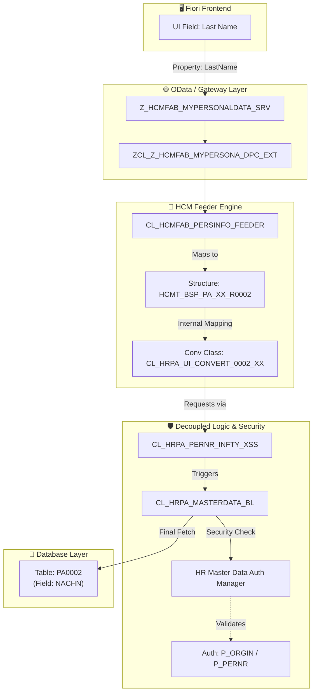

# HCM Data Flow & Authorization Connectivity (UNESCO)

This document maps the journey of a data field from the Fiori UI down to the SAP database and the security gates (Authorization Objects) it must pass.

## 1. Field Connectivity Map: PA0002 (Personal Data)

| Fiori UI Field (OData Property) | UI Structure Field (HCMT_BSP_PA_XX_R0002) | DB Field (PA0002) | Description |
| :--- | :--- | :--- | :--- |
| `LastName` | `LAST_NAME` | `NACHN` | Last Name |
| `FirstName` | `FIRST_NAME` | `VORNA` | First Name |
| `BirthDate` | `BIRTH_DATE` | `GBDAT` | Date of Birth |
| `Nationality` | `NATIONALITY` | `NATIO` | Nationality |
| `Gender` | `GENDER` | `GESCH` | Gender Key |
| `ZZREGGR` (UNESCO) | `ZZREGGR` | `ZZREGGR` | Regional Group (Custom) |

---

## 2. Authorization Layer (Security Gates)

The Fiori app uses the **HR decoupled framework (HRPA)**. All data access is intercepted by the **HR Master Data Authorization Manager**.

### Core Authorization Objects checked:
| Object | Field | Value / Usage | Purpose |
| :--- | :--- | :--- | :--- |
| **`P_ORGIN`** | `INFTY` | `0002`, `0021`, etc | Primary check for Infotype access. |
| | `SUBTY` | `*` | Subtype access (e.g., Child vs Spouse). |
| | `AUTHC` | `R` (Read) / `W` (Write) | Operation type. |
| **`P_PERNR`** | `AUTHC` | `R` / `W` | **The "Self-Service" Gate**: Controls if the user can view/edit their own personnel number. Essential for ESS apps. |
| | `PSIGN` | `I` (Include) | |
| **`P_ORGXX`** | | | Extended organizational check (if active at UNESCO). |

---

## 3. The Connectivity Path (End-to-End)

---

## 4. The Workflow Staging Path (Parked Action)

For actions involving a "Parking" step (e.g., Offboarding, Birth of Child):

| Stage | Action / Event | Target Table | Logic |
| :--- | :--- | :--- | :--- |
| **Draft** | User Clicks 'Save' | `ASR Buffer` / `zthrfiori_hreq` | Values are stored as XML or Staging rows. No PA update. |
| **Workflow** | `SAP_WAPI_START_WORKFLOW` | `SWWWIHEAD` | The Request ID links UI context to the workitem. |
| **Posting** | Final Approval | `HR_INFOTYPE_OPERATION` | Data is finally moved to `PA0021` or `PA0016`. |

---

## 5. How to Debug Field Discrepancies
1. **Wrong Value?**: Check the Conversion Class `CL_HRPA_UI_CONVERT_XXXX_XX`. The mapping logic from `PAxxxx` to `HCMT_BSP_...` lives there (methods `OUTPUT_CONVERSION` and `INPUT_CONVERSION`).
2. **Missing Field?**: Verify table **`T588M`** (Screen Modification). If it's hidden there for the UNESCO molga, the Feeder will hide it in Fiori.
3. **No Authorization?**: Use transaction `SU53` in the backend immediately after the Fiori error. Look specifically for failed `P_ORGIN` or `P_PERNR` checks with the user's PERNR.
4. **Audit Gap?**: Use `ZCL_HRFIORI_PF_COMMON` methods to retrieve the original staged JSON/XML if the final posting failed.
