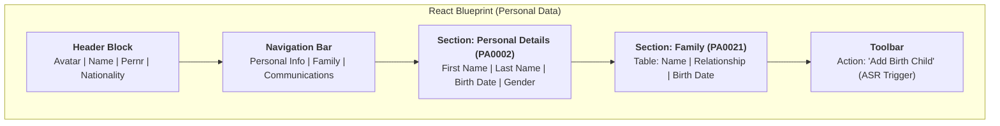

# [Fiori Analysis] HCM Personal Data (UNESCO Personal Information)
> **Artifact Type**: Fiori App Analysis (UI Blueprint & Backend Logic)

---

# PART I: CURRENT SAP LANDSCAPE (THE REALITY)

This section documents the existing SAP backend architecture and framework as it operates today.

## 1. Domain Overview
The **My Personal Data** application is a core HCM Fiori app used at UNESCO to manage employee profile information, civil status, and family members. It follows a hybrid architectural pattern:
- **Standard Frame**: Uses the standard SAP `HCMFAB_MYPERSONALDATA` framework.
- **Custom UNESCO Actions**: Triggers complex workflows for sensitive background updates via the **ASR (HCM Processes & Forms)** framework.

## 2. Technical Architecture & Routing

### 2.1 Backend Routing Layer
| Object | Type | Role |
| :--- | :--- | :--- |
| `Z_PERS_MAN_EXT` | BSP App | UNESCO Extension of the standard Personal Data UI. |
| `Z_HCMFAB_MYPERSONALDATA_SRV` | OData Service | Main service for reading profile and field metadata. |
| `ZHR_PROCESS_AND_FORMS_SRV` | OData Service | UNESCO Hub for triggering action-based workflows (ASR). |
| `zthrfiori_dep_dl` | Custom Table | **Campaign Registry**: Defines deadlines and survey periods for global NGO campaigns. |
| `pa0105` (Subtype 0001) | Standard Table | **Context Mapping**: Resolves System User ID (`SY-UNAME`) to Personnel Number (`PERNR`). |

### 2.2 Integration Hierarchy (Redefinition)
UNESCO uses nested redefinition to inject logic into the standard pipeline:
```
ZCL_Z_HCMFAB_MYPERSONA_DPC_EXT (UNESCO Endpoint)
  └── ZCL_Z_HCMFAB_MYPERSONA_DPC (UNESCO Base)
        └── CL_HCMFAB_MYPERSONALDA_DPC_EXT (SAP Standard Extension)
              └── CL_HCMFAB_MYPERSONALDA_DPC (SAP Standard Model)
```

## 3. Field-Level End-to-End Mapping (Reality)

| UI Section | Field Label | OData Property | Backend Field | DB Table | Logic / Rule |
| :--- | :--- | :--- | :--- | :--- | :--- |
| **Header** | Name | `EmployeeName` | `ENAME` | `PA0001` | Calculated Concatenation |
| **Header** | Image | `EmployeePicture` | `PICTURE` | `ARCHIV` | GOS / Archive Link |
| **Details** | First Name | `FirstName` | `VORNA` | `PA0002` | Standard Read |
| **Details** | Last Name | `LastName` | `NACHN` | `PA0002` | Standard Read |
| **Details** | Birth Date | `BirthDate` | `GBDAT` | `PA0002` | Standard Read |
| **Family (Tab)** | Family Name | `I0021_FANAM` | `FANAM` | `PA0021` | ASR Action Needed to Edit |
| **Family (Tab)** | Child Name | `I0021_FAVOR` | `FAVOR` | `PA0021` | ASR Action Needed to Edit |
| **Family (Tab)** | Category | `I0021_FAMSA` | `SUBTY` | `PA0021` | Subtype 14 = Child |
| **Family (Tab)** | Education | `I0021_EDUAT` | `EDUAT` | `PA0021` | Mandatory if Age > 18 |

## 4. Field Control & Visibility Strategy (Reality)

### 4.1 Layer 1: Standard HCM Customizing (T588M)
The OData service utilizes `CL_HCMFAB_PERSINFO_FEEDER`. This class reads the SAP standard **Infotype Screen Modification (T588M)**.
- If a field is set to "Hide" in T588M for the specific Molga/Infotype, the feeder automatically sets `is_visible = false`.

### 4.2 Layer 2: Feeder Attribute Mapping
The mapping from SAP Screen attributes to Fiori OData attributes happens in:
`CL_HCMFAB_PERSINFO_FEEDER->MAP_FIELD_ATTRIBUTES`
- Property `A` → `Read Only` | Property `B` → `Hidden` | Property `C` → `Mandatory`

### 4.3 Layer 3: UNESCO BAdI Configuration
UNESCO overrides layers 1 and 2 using BAdI `HCMFAB_B_PERSINFO_CONFIG` (Implementation `YCL_IM_PERSINFOUI_0006`).

## 5. Security & Authorization Matrix (Reality)

The following guards are enforced by SAP and MUST be respected by any interface:

| Auth Object | Field | Value | Purpose / Impact |
| :--- | :--- | :--- | :--- |
| **P_ORGIN** | `INFOTY` | `0002, 0021, 0006` | Controls if data blocks (Personal, Family, Address) are returned. |
| **P_PERNR** | `AUTHC` | `R, W` | **The Self-Service Gate**: Essential to ensure users only see their own record. |
| **PLOG** | `OTYPE` | `P / 0001` | Structural Auth (O-S-P) to verify organizational residence. |

## 6. ASR Workflow & Audit Intelligence (Reality)

### 6.1 Identifying "Pending" Actions
When a user launches the app, it calls `ZHR_PROCESS_AND_FORMS_SRV`.
- **Inbox Search**: Reads `SWWWIHEAD` (Workitem Inbox) filtered by ASR Scenario IDs.
- **Object State**: If a process is in state `IN_PROGRESS`, the system directs the user to "Resume".

### 6.2 The Digital Audit Trail
Every action in the ASR UI is recorded in:
- `T5ASRPROCESSES`: Global Process ID.
- `T5ASRSTEPS`: Step-by-step chronology (Who, When, Status).
- `T5ASRDATAVAR`: **The Digital Ledger**: Field snapshots (Audit of values before/after change).
- `ZCL_HRFIORI_PF_COMMON`: **Recovery Engine**: ABAP utility used to reconstruct form data from the ASR containers for auditors.

---

# PART II: FORWARD-THINKING IMPLEMENTATION (THE STRATEGY)

This section outlines how the React application will replicate and optimize the current reality.

## 7. UI Schema & Layout Blueprint (React)

### 7.1 Layout Wireframe (Conceptual)


## 8. React Implementation Strategy

### 8.1 State Management & Redaction
- **Global Store**: Holds `EmployeeProfile` and `Metadata` flags.
- **ASR Handler**: A specialized hook `useASRScenario` to manage the lifecycle of Dialogs (Open -> Bind -> Submit).

### 8.2 Custom Hooks Recommendation
- `useProfileData()`: Fetches data including `is_visible`/`is_editable` metadata flags.
- `useActivityTimeline()`: Calls `ProcessStepSet` to build a professional timeline in the UI.

## 9. UX Edge Cases & Performance Patterns

### 9.1 Performance: OData Batching
- Use **$batch** to fetch Personal Data and Family Data in a single round-trip, addressing high latency in remote offices.

### 9.2 UX Patterns
- **Empty States**: Display friendly illustrations for empty family tables.
- **Skeleton Screens**: Use for the Header block and Family Table to reduce perceived latency.

## 10. Development Mock Payload (JSON)
*Use this structure to simulate the React State during development.*

```json
{
  "d": {
    "Pernr": "00123456",
    "EmployeeName": "JEAN DE LA FONTAINE",
    "FirstName": "JEAN",
    "LastName": "DE LA FONTAINE",
    "BirthDate": "19700101",
    "FamilyMembers": [
      { "Name": "MARIE DE LA FONTAINE", "Rel": "Spouse", "ASR_Trigger": false },
      { "Name": "CLAUDE DE LA FONTAINE", "Rel": "Child", "ASR_Trigger": true }
    ]
  }
}
```

---

## 11. Reverse Engineering Notes (Synthesis)
- **Metadata Discovery**: Check `CL_HCMFAB_PERSINFO_DPC_UTIL` for hidden metadata logic.
- **ASR Routing**: All action-based Fiori UIs call `ZHR_PROCESS_AND_FORMS_SRV`.
- **Decoupled Future**: New apps can be defined as new ASR Scenarios without backend OData changes.
