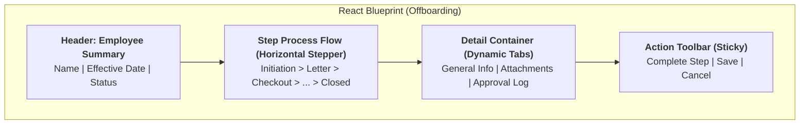

# [Fiori Analysis] HR Offboarding App (UNESCO Employee Offboarding)
> **Artifact Type**: Fiori App Analysis (UI Blueprint & Backend Logic)

---

# PART I: CURRENT SAP LANDSCAPE (THE REALITY)

This section documents the existing SAP backend architecture and framework as it operates today.

## 1. Application Overview (Reality)
- **Primary OData Service**: `ZHRF_OFFBOARD_SRV`
- **ABAP Package**: `ZHRBENEFITS_FIORI` (Custom HR Fiori Framework)
- **Core Persistence**: Custom tables `zthrfiori_hreq` (Header) and `zthrfiori_reqsta` (Status).
- **Audit/History**: `zthrfiori_dapprv` (Approvals) and standard Workflow logs.
- **NGO Campaign Registry**: `zthrfiori_dep_dl` (Manages global deadlines/surveys).

## 2. Technical Architecture & State Machine

### 2.1 OData & Backend Class Architecture
- **MPC Extension Class**: `ZCL_ZHRF_OFFBOARD_MPC_EXT` (Definitions)
- **DPC Extension Class**: `ZCL_ZHRF_OFFBOARD_DPC_EXT` (Runtime logic)
- **Core Business Logic Class**: `ZCL_HR_FIORI_OFFBOARDING_REQ`

### 2.2 Workflow Step Registry (The 12-Step State Machine)
The offboarding process is governed by table `zthrfiori_offb_s`. Each step corresponds to a boolean flag in the state table `zthrfiori_reqsta`.

| ID | Step Code | Description | DB Flag Field |
|:---|:---|:---|:---|
| 01 | `REQUEST_INIT` | Request Created | `FLAG` (Step 01) |
| 05 | `CHECKOUT` | Checkout | `FLAG` (Step 05) |
| 06 | `TRAVEL` | Travel Clearance | `FLAG` (Step 06) |
| 07 | `SHIPMENT` | Shipment Handling | `FLAG` (Step 07) |
| 11 | `CLOSED` | Completed | `FLAG` (Step 11) |

## 3. Field-Level End-to-End Mapping (Reality)

| UI Section | Field Label | OData Property | Backend Field | DB Table | Logic / Rule |
| :--- | :--- | :--- | :--- | :--- | :--- |
| **Header** | Name | `EmployeeName` | `ENAME` | `PA0001` | Calculated Concatenation |
| **Header** | Effective Date | `Effective_Date` | `T529U-BEGDA` | `zthrfiori_hreq` | Separation Date from Action |
| **Header** | Status | `Status` | `TXT` | `zthrfiori_reqsta` | Text from Registry |
| **Details** | Contract Type | `ContractType` | `ANSVH` | `PA0016` | UI Filter Condition |
| **Details** | Reason | `Reason` | `REASON` | `ZD_HRFIORI_REASON` | Dropdown Source |

## 4. Workflow Intelligence & Pending Actions (Reality)

### 4.1 Identifying "Pending" Steps (Waterfall Logic)
The method `GET_PENDING_ACTION` identifies the state:
1. **Fetch State**: Reads `zthrfiori_reqsta` for the specific GUID.
2. **Scan**: The first empty field in the ordered list (01-11) is the **Active Pending Step**.
3. **Sequential Enforcement**: Steps beyond `Active + 1` are locked in the backend.

### 4.2 Audit Trail & History (zthrfiori_dapprv)
Every bit-flip is logged to preserve a historical footprint:
- `TIMESTAMP`: ISO Date/Time of action.
- `UNAME`: SAP User who performed the step.
- `ACTION`: A (Approved), R (Rejected), C (Completed).

### 4.3 Staging Strategy (The "Parking Lot")
This application follows the **HCM-as-Finance-Posting** pattern:
- **Parked Mode**: Data is staged in `zthrfiori_hreq` while the workflow is active. It does NOT update standard PA tables yet.
- **Posting Mode**: Background jobs or approval hooks perform the final `HR_INFOTYPE_OPERATION` to PA0105 or PA0166 upon workflow completion.
- **Auditor Benefit**: Full recovery of "In-Flight" separation data via `zthrfiori` tables before master record update.

## 5. Security & Authorization Matrix (Reality)

| Auth Object | Field | Value | Role / Usage |
| :--- | :--- | :--- | :--- |
| **P_ORGIN** | `INFOTY` | `0016, 0001` | Verify contract eligibility for offboarding. |
| **S_SERVICE** | `SRV_NAME` | `ZHRF_OFFBOARD_SRV` | Standard OData execution permission. |
| **Z_OFFB_ACT** | `ACTVT / STEP` | `01, 05, 06` | **UNESCO Object**: Controls who can "Complete" specific steps (e.g., Travel Unit). |

---

# PART II: FORWARD-THINKING IMPLEMENTATION (THE STRATEGY)

This section outlines how the React application will replicate and optimize the current reality.

## 6. UI Schema & Layout Blueprint (React)

### 6.1 Layout Wireframe (Conceptual)


## 7. React Implementation Strategy

### 7.1 State Management (Process Flow)
- **StateMachine Engine**: Use `XState` to manage the complex 12-step transition logically.
- **Wizard State**: Persist draft states to ensure session continuity.

### 7.2 Visibility Engine Replication
- `OffboardingLayout`: Wrapper containing the Stepper.
- `StepContainer`: Dynamically loads components (e.g., `TravelStep`) based on the active pending step calculated from `zthrfiori_reqsta`.

## 8. UX & Performance Patterns

### 8.1 The Stepper Pattern
- **Non-Linear Steps**: Allow parallel navigation (Travel/Shipment) in the UI without sequential completion.
- **Attachment Pre-flight**: Client-side validation before triggering the OData upload.

## 9. Error Handling & Workflow Feedback

| Step Scenario | Backend Response | UI Behavioral Pattern |
| :--- | :--- | :--- |
| Out-of-Sequence Skip | `E / ZHR / 001` | Disable 'Complete' button, show Hint message |
| Missing Attachment | `W / ZHR / 042` | Mandatory Upload dialog focus |
| Concurrent Edit | `E / SY / 123` | Optimistic lock alert, refresh required |

## 10. Development Mock Payload (JSON)

```json
{
  "d": {
    "Guid": "4266250E770D49B781A6376EAEC48211",
    "CurrentStep": "05",
    "EffectiveDate": "20261231",
    "Steps": [
      {"Id": "01", "Status": "X", "Text": "Initiation"},
      {"Id": "05", "Status": "O", "Text": "Checkout In Progress"},
      {"Id": "11", "Status": " ", "Text": "Closed"}
    ]
  }
}
```

---

## 11. Reverse Engineering Notes (Synthesis)
- **State Persistence**: Every UI step completion must bit-flip `zthrfiori_reqsta`.
- **Visibility Extension**: Travel visibility logic is hardcoded in the logic class based on PA data.
- **Audit Logic**: Retrieval for the React "History" tab must filter `WorkflowStepSet` by Request GUID.
