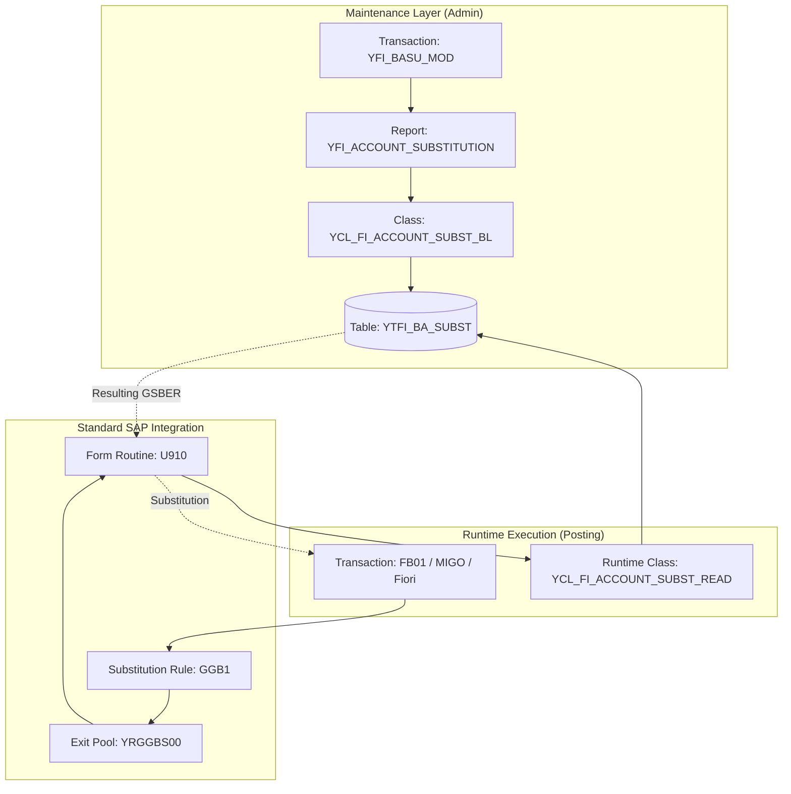

# Technical Autopsy: Custom Business Area Substitution Framework (YFI_BASU_MOD)

## 1. Overview
UNESCO uses a "hidden" custom substitution framework to manage Business Area (`GSBER`) derivations based on G/L Accounts (`HKONT`). This framework bypasses the standard `GGB1` (Substitution) transport-locked configurations, allowing functional users to maintain rules via a custom transaction.

## 2. Technical Architecture

### 2.1 Component Stack
| Layer | Object | Description |
| :--- | :--- | :--- |
| **Transaction** | `YFI_BASU_MOD` | User interface for maintenance. |
| **Program** | `YFI_ACCOUNT_SUBSTITUTION` | Main report driver. |
| **Logic Class** | `YCL_FI_ACCOUNT_SUBST_BL` | Encapsulates ALV logic and persistence. |
| **Runtime Class**| `YCL_FI_ACCOUNT_SUBST_READ` | Optimized class for lookup during posting. |
| **Persistence** | `YTFI_BA_SUBST` | Stores range-based mapping rules. |

### 2.2 Integration Point
The framework is called from the standard SAP Substitution Exit framework:
- **Formpool**: `YRGGBS00`
- **Form**: `U910` (Business Area Substitution)
- **Calling Code**: 
  ```abap
  lv_gsber = ycl_fi_account_subst_read=>read( 
               iv_bukrs = bseg-bukrs
               iv_blart = bkpf-blart
               iv_hkont = bseg-hkont ).
  ```

## 3. Business Logic workflow
The `READ` method implements a two-tier lookup strategy:

1.  **Tier 1: Document Type Specific**
    - Query `YTFI_BA_SUBST` where `BUKRS` = Document BUKRS AND `BLART` = Posting Document Type.
    - Check if the posting `HKONT` is within the defined `SIGN/OPTION/LOW/HIGH` ranges.
2.  **Tier 2: Global Fallback**
    - If no match in Tier 1, Query `YTFI_BA_SUBST` where `BUKRS` = Document BUKRS AND `BLART` is EMPTY.
    - Check ranges for the account.

## 4. Connecting the Dots (System Flow)

The following diagram illustrates how the maintenance of rules via the custom transaction translates into active substitution during financial postings.



## 5. Why This Exists (Operational Impact)
- **Agility**: Allows BFM (Bureau of Financial Management) to add or change account-to-business-area mappings without needing a transport or an ABAPer.
- **Complexity Management**: Standard `GGB1` Boolean logic becomes unreadable with hundreds of accounts. Using a table with ranges is significantly more maintainable.

## 6. Metadata Mapping
To reconstruct this logic in an external environment (e.g., React clone), the following data is required:
- **Table**: `YTFI_BA_SUBST` (Full export)
- **Rules**: Mapping of `BUKRS` -> `BLART` -> `Range of HKONT` -> `GSBER`.
- **Exit Logic**: Verification of the "Fallback" sequence (DocType specific vs. Global).
