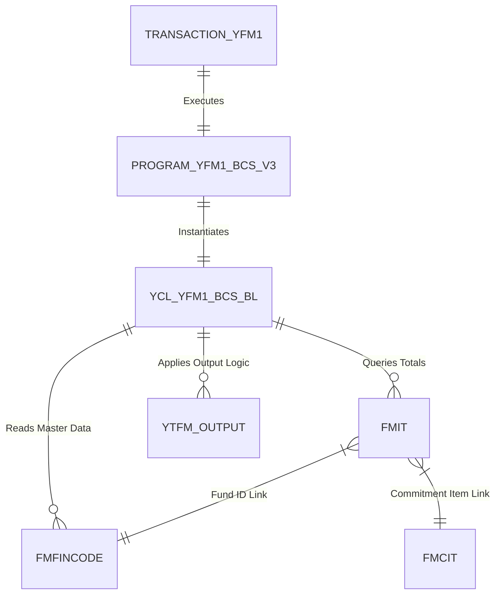
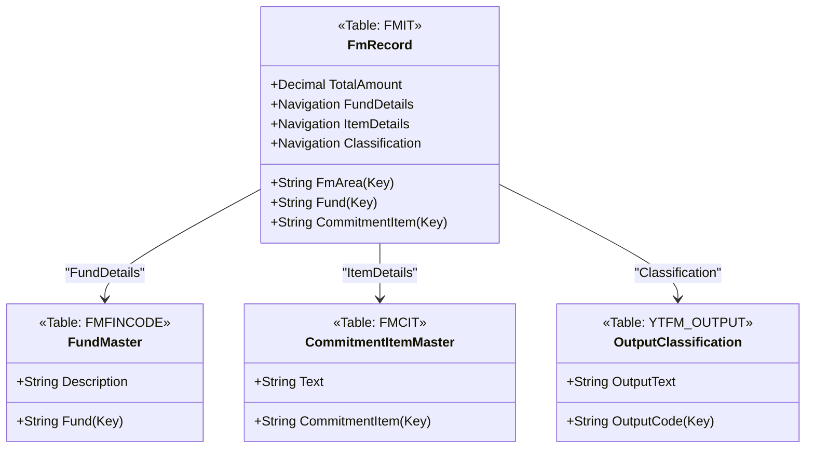
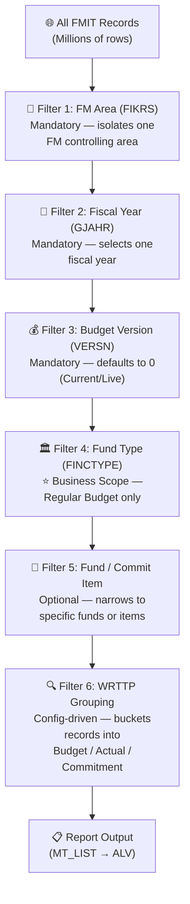

# Technical Analysis: UNESCO Fund Management Report (YFM1)

## Overview
- **Transaction**: `YFM1` (UNESCO Fund Management Report)
- **Underlying Program**: `YFM1_BCS_V3` (BCS-based aggregated FM report with UNESCO output logic, Package `YB`)
- **Core Business Logic Class**: `YCL_YFM1_BCS_BL` (FM Report extraction, calculation, and ALV rendering logic, Package `YB`)
- **Primary Purpose**: Aggregated reporting of Funds Management (FM) data, including budget, commitments, and expenditures, with support for UNESCO-specific output formats.

### Related Transactions (Landscape)

| Transaction | Program | Relationship | Notes |
| :--- | :--- | :--- | :--- |
| `YFM1` | `YFM1_BCS_V3` | **This report** | BCS-based aggregated FM report with UNESCO output logic. |
| `YFM2` *(unconfirmed)* | — | Potential sibling | May exist as a variant (e.g., detail-level or different output). Needs verification via `TSTC`/`TADIR` scan. |
| `FMAVCR01` | Standard | Standard SAP | Availability Control — shows budget vs. consumed. Useful for cross-validation. |
| `FMRP_RFFMEP1AX` | Standard | Standard SAP | Standard FM Line Item Report. Most comprehensive SAP-delivered FM report. |
| `S_ALR_87013019` | Standard | Standard SAP | Financial overview by Fund/Commitment Item. Alternative cross-check source. |

> [!NOTE]
> **Sibling Discovery**: To identify all UNESCO custom FM transactions, query `TADIR` with `OBJECT = 'TRAN'` and `DEVCLASS = 'YB'`, or scan `TSTC` for entries matching `YFM*`.

## Discovery Protocol (Backend-First)
> [!IMPORTANT]
> **Real Data Priority**: This analysis prioritized RFC/Backend metadata over UI observations. The following systematic mapping was used to ensure object-agnostic accuracy.

1. **Object Inventory**: Queried `TADIR` for all related `YFM1*` includes and side-car programs in package `YB`.
2. **Class Mapping**: Utilized `SEOCOMPO` and `RPY_PROGRAM_READ` on method includes (`CMxxx`) to isolate business logic from UI wrapper logic.
3. **Security Baseline**: Validated transaction-level requirements via `TSTCA` and `USOBT` data before performing deep-scans of ABAP source code.

## Technical Components

### 1. ABAP Program: `YFM1_BCS_V3`
The program acts as a wrapper that:
1. Initializes the business logic class `YCL_YFM1_BCS_BL`.
2. Passes selection screen parameters (ranges for Fund, FM Area, Fiscal Year, etc.) to the class via `SET_SELECTION_VALUES`.
3. Triggers data retrieval via `GET_DATA`.
4. Displays results using `DISPLAY_ALV`.

### 2. Core Class: `YCL_YFM1_BCS_BL`
This class encapsulates the report's intelligence.

#### Key Methods:
- `SET_SELECTION_VALUES`: Maps selection screen ranges to internal data structures.
- `GET_DATA`: The main engine that queries database tables and calculates totals.
- `READ_DATA_FROM_DB`: Performs `SELECT` statements against FM tables.
- `COMPUTE_TOTAL_AMOUNTS`: Aggregates period-based values (`HSL01` to `HSL16`) into report totals.
- `PREPARE_DATA`: Processes raw DB data into the final output format.
- `DISPLAY_ALV`: Utilizes `CL_SALV_TABLE` for a modern, grid-based report display.

#### Entity Relationship & Data Model:
The report centers around the **BCS (Budget Control System)** totals and master data.

| Table | Role | Key Fields |
| :--- | :--- | :--- |
| **FMIT** | **FM Totals Table** | `FIKRS` (FM Area), `RFONDS` (Fund), `RWRTTP` (Value Type), `RYEAR` (Fiscal Year) |
| **FMBDT** | FM Budget Entries | `BUDTYPE` (Budget Type) |
| **FMFINCODE** | Funds Master Data | `FINCODE` (Fund ID), `FIKRS` |
| **FMCIT** | Commitment Items | `FIPEX`, `FIKRS` |
| **YTFM_OUTPUT** | Custom Metadata | UNESCO-specific output classifications |
| **YTFM_WRTTP_GR** | Value Type Grouping | Maps specific value types (Actual, Commitment, Budget) for UNESCO reporting |

### 3. Data Flow Logic
1. **Selection**: User filters by FM Area (`FIKRS`), Fund (`FINCODE`), and Fiscal Year (`GJAHR`).
2. **Retrieval**: Large-scale `SELECT` from `FMIT` gathering period values `HSL01` through `HSL16`.
3. **Calculation**:
    - `WRTTP` (Value Type) determines if the amount is Budget, Commitment, or Actual.
    - Custom groupings from `YTFM_WRTTP_GR` are applied to align with UNESCO's financial structures.
4. **Enrichment**: Master data from `FMFINCODE` and `FMCIT` is merged to provide descriptive texts.
5. **Output**: Data is formatted into `MT_LIST` and displayed via ALV.

## Entity Relationship Model (ERM) - Conceptual
The following diagram illustrates the relationship between the transaction, the ABAP logic, and the standard FM tables.



## Entity Data Model (EDM) - OData Logical View
This section provides a logical data model designed for potential OData service development (SAP Gateway). Each entity is mapped to its underlying SAP database table.

### 1. Entities

#### **Entity: FmRecord** (Table: `FMIT`)
- **Key**: `FmArea`, `Fund`, `CommitmentItem`, `FiscalYear`, `ValueType`
- **Properties**: `Currency`, `BudgetType`, `PeriodAmount01..16`, `TotalAmount`

#### **Entity: FundMaster** (Table: `FMFINCODE`)
- **Key**: `FmArea`, `Fund`
- **Properties**: `Description`, `FundType`, `CreationDate`

#### **Entity: CommitmentItemMaster** (Table: `FMCIT`)
- **Key**: `FmArea`, `CommitmentItem`
- **Properties**: `Text`

#### **Entity: OutputClassification** (Table: `YTFM_OUTPUT`)
- **Key**: `OutputCode`
- **Properties**: `Sector`, `OutputText`

### 2. Associations & Navigation
- **FmRecord** (N) <-> (1) **FundMaster** 
- **FmRecord** (N) <-> (1) **CommitmentItemMaster**
- **FmRecord** (N) <-> (1) **OutputClassification**




## Report Specification & Calculation Logic

This section outlines the functional behavior and the technical calculation engine of the `YFM1` report.

### 0. Business Scope Filters (Filter Chain)

> [!IMPORTANT]
> **The filters used in a report define the scope of the information it produces.** Understanding the complete filter chain is essential before interpreting any output or replicating the logic.

The following filters act as a **layered funnel** that progressively narrows the data from all SAP FM records down to only the records relevant for this report:



#### Complete Filter Summary

| # | Filter | Field | Applied At | Scope Effect | Reference |
| :---: | :--- | :--- | :--- | :--- | :--- |
| 1 | **FM Area** | `FIKRS` | `WHERE` clause on `FMIT` | Isolates one FM controlling area. All data belongs to one organizational unit. | Selection Screen |
| 2 | **Fiscal Year** | `GJAHR` / `RYEAR` | `WHERE` clause on `FMIT` | Restricts to one fiscal year. No cross-year data. | Selection Screen |
| 3 | **Budget Version** | `VERSN` | `WHERE` clause on `FMIT` | Selects version `0` (live data) vs. planning scenarios. | Selection Screen |
| 4 | **Fund Type** | `FINCTYPE` | `JOIN` with `FMFINCODE` | ⭐ **Business Scope Filter.** Restricts to Regular Budget (`RB`) funds. Excludes Extrabudgetary, Trust Funds, Special Accounts. | [Filter Registry: FINCTYPE_FM](file:///c:/Users/jp_lopez/projects/abapobjectscreation/.agents/skills/unesco_filter_registry/SKILL.md#finctype_fm--fund-type--budget-category-business-scope-filter) |
| 5 | **Fund / Commitment Item** | `RFONDS` / `FIPEX` | `WHERE` clause on `FMIT` | Optional drill-down to specific funds or expenditure categories. | Selection Screen |
| 6 | **Value Type Grouping** | `RWRTTP` | Post-retrieval grouping via `YTFM_WRTTP_GR` | Classifies each record as Budget, Actual, or Commitment. Drives columns J, K, L. | [Filter Registry: WRTTP_FM](file:///c:/Users/jp_lopez/projects/abapobjectscreation/.agents/skills/unesco_filter_registry/SKILL.md#wrttp_fm--funds-management-value-type-grouping) |

#### Scope Definition Statement

> **This report answers the question:**
> *"For a given FM Area and Fiscal Year, what is the budget execution status (approved budget vs. spent vs. committed vs. available) of UNESCO's **Regular Budget** funds, using the current live budget version?"*

#### What is explicitly **excluded**:
- ❌ Extrabudgetary (XB) project funds
- ❌ Trust Fund (TF) operations
- ❌ Special Accounts (SA) and self-financed activities
- ❌ Planning/scenario budget versions (VERSN ≠ 0)
- ❌ Cross-year consolidated views (single year only)

### 1. Selection Criteria (Input Parameters)
The report filters database records based on the selection screen input. These parameters are passed to `YCL_YFM1_BCS_BL->SET_SELECTION_VALUES`.

> [!IMPORTANT]
> **Selection filters define the business scope of the report.** They are not just optional inputs — they tell us *what this report is built for*. Every filter reveals a business constraint that must be preserved when replicating the logic in OData or other channels.

| Parameter | Technical Field | Mandatory | Business Meaning | What This Filter Tells Us |
| :--- | :--- | :--- | :--- | :--- |
| **FM Area** | `FIKRS` | Yes | Primary organizational filter. | The report operates within **one FM Area at a time**. UNESCO typically uses a single FM Area, but this filter ensures data isolation in multi-area landscapes. |
| **Fund** | `RFONDS` | No | Filters for specific funds or ranges. | When left open, the report shows **all funds** within the FM Area (subject to Fund Type filter). When specified, it narrows to specific fund codes. |
| **Fund Type** | `FINCTYPE` | No ⚠️ | **Business Scope Filter.** Groups funds by UNESCO classification (Regular Budget, Extrabudgetary, Trust Funds, etc.). | ⚠️ **This is a Business Scope Filter.** This report is designed for **Regular Budget (RB) funds**. The `FINCTYPE` filter restricts `FMFINCODE` records to only those funds classified as Regular Budget. If omitted or set to RB, the report excludes Extrabudgetary (XB), Trust Funds, and Special Accounts — fundamentally changing the financial picture. |
| **Commitment Item** | `FIPEX` | No | Filters by expenditure categories. | When left open, all commitment items are included. When specified, allows drill-down into specific expense types (e.g., only Travel, only Equipment). |
| **Fiscal Year** | `GJAHR` | Yes | Defines the reporting period. | The report **requires a fiscal year** — it cannot run without one. This scopes `FMIT` data to a specific year. Multi-year analysis requires multiple executions. |
| **Budget Version** | `VERSN` | Yes | Selects the budget version. Defaults to `0` (Current/Actual). | Version `0` = the live, current budget. Other versions (1, 2, etc.) represent planning scenarios or historical snapshots. The default of `0` means the report shows **real, active budget data** by default. |

#### Business Scope Summary
Based on the selection filters, this report's **intended business purpose** is:

> **"Show the budget execution status (budget vs. expenditure vs. commitments) for Regular Budget funds within a specific FM Area and Fiscal Year, using the current budget version."**

This means:
- 🎯 **Target audience**: Budget officers managing UNESCO's Regular Budget allocation
- 🚫 **Out of scope**: Extrabudgetary projects, trust funds, special accounts, donor-funded activities
- 📅 **Time scope**: Single fiscal year at a time
- 💰 **Budget version**: Current/live data (version 0), not planning scenarios


### 2. Output Framework (ALV Columns)
The final results are stored in the internal table `MT_LIST` and displayed via `CL_SALV_TABLE`.

| # | Column Label | Technical Basis | Grouping | Description |
| :---: | :--- | :--- | :--- | :--- |
| A | **FM Area** | `FIKRS` | Key Field | The Funds Management Area. Primary organizational filter inherited from the selection screen. Groups all data under one FM controlling area. |
| B | **Fund** | `RFONDS` | Key Field | The Fund identifier from `FMIT`. Used as a primary grouping key for the report row. |
| C | **Fund Text** | `FMFINCODE-BEZEICH` | Enrichment | Descriptive name of the Fund. Joined from master data table `FMFINCODE` during the `PREPARE_DATA` enrichment step. |
| D | **Fund Center** | `FISTL` | Key Field | The responsible organizational unit (cost center equivalent in FM). Groups spending by department or unit. |
| E | **Commitment Item** | `FIPEX` | Key Field | The expenditure category (e.g., Travel, Equipment). Equivalent to a G/L account in FM context. |
| F | **Commitment Item Text** | `FMCIT-TEXT1` | Enrichment | Descriptive name of the Commitment Item. Joined from `FMCIT` during enrichment. |
| G | **Output / Code** | `YTFM_OUTPUT` | Key Field | UNESCO-specific output classification. Derived from the custom metadata table `YTFM_OUTPUT` to align with UNESCO's Results-Based Budgeting framework. |
| H | **Fiscal Year** | `RYEAR` / `GJAHR` | Key Field | The fiscal year of the record. Passed from the selection screen and used to partition `FMIT` data. |
| I | **Currency** | `RBTCURR` / `TWAER` | Display | The house currency of the amounts (e.g., `USD`). Taken from `FMIT` header or company code configuration. |
| J | **Initial Budget** | `HSL_BUDGET_INIT` | `WRTTP` Group: Budget | Sum of period amounts (`HSL01`–`HSL16`) from `FMIT` where `RWRTTP` ∈ Budget group per `YTFM_WRTTP_GR`. Filtered WRTTP: `01`, `02`, `03`, `04`, `05`, `06`, `11`, `12`, `13`, `14`, `61`⚠️, `62`⚠️, `63`, `64`, `65`, `66`⚠️. Represents total approved budget including supplements, returns, and transfers. |
| K | **Expenditure** | `HSL_EXPENDITURE` | `WRTTP` Group: Actual | Sum of period amounts where `RWRTTP` ∈ Actual group. Filtered WRTTP: `54` (Down Payments), `57` (Actual/Invoice), `58` (Revenue), `61`⚠️, `66`⚠️ (context-dependent). Represents money spent, invoiced, or received. |
| L | **Commitment** | `HSL_COMMITMENT` | `WRTTP` Group: Commitment | Sum of period amounts where `RWRTTP` ∈ Commitment group. Filtered WRTTP: `50` (Purchase Req), `51` (Purchase Order), `52` (Earmarked Funds), `53` (Precommitments), `55` (Travel). Represents funds earmarked for future obligations. |
| M | **Total Expenditure** | Calculated | Calculated | **Virtual column**. Formula: `Expenditure (K) + Commitment (L)`. Represents the total financial obligation (spent + committed). |
| N | **Available Balance** | `HSL_AVAILABLE` | Calculated | **Virtual column**. Formula: `Initial Budget (J) − Total Expenditure (M)`. Shows remaining funds that can still be utilized. Computed by `COMPUTE_TOTAL_AMOUNTS`. |
| O | **Utilization %** | Calculated | Calculated | **Virtual column**. Formula: `(Total Expenditure (M) / Initial Budget (J)) × 100`. Shows percentage of budget consumed. Displays 0 or blank if Budget = 0 to avoid division error. |

> [!NOTE]
> **⚠️ WRTTP Filter Reference**: For the complete list of WRTTP value type codes and their group assignments, see the [UNESCO Filter Logic Registry](file:///c:/Users/jp_lopez/projects/abapobjectscreation/.agents/skills/unesco_filter_registry/SKILL.md#wrttp_fm--funds-management-value-type-grouping).

### 3. Calculation Engine
The heart of the report is the dynamic accumulation of values from the `FMIT` table.

#### **A. Value Type Grouping (`YTFM_WRTTP_GR`)**
Instead of hardcoding simple totals, the report uses metadata from `YTFM_WRTTP_GR` to bucket SAP Value Types (`RWRTTP`) into UNESCO reporting groups. The table below lists all standard SAP FM Value Types and how each is mapped:

##### Complete WRTTP Reference

| WRTTP | SAP Standard Description | UNESCO Group | Notes |
| :---: | :--- | :--- | :--- |
| `01` | Original Budget (Plan) | **Budget** | Initial approved budget allocation for the fiscal year. |
| `02` | Budget Supplements | **Budget** | Additional budget allocations approved after the original. |
| `03` | Budget Returns | **Budget** | Budget returned/given back (reduces available budget). Sign is typically negative. |
| `04` | Budget Transfers (From) | **Budget** | Budget transferred out to another fund/item. Sign is typically negative. |
| `05` | Budget Transfers (To) | **Budget** | Budget received from another fund/item. |
| `06` | Released Budget | **Budget** | Portion of budget released for spending. May differ from total if release strategy is used. |
| `11` | Current Budget | **Budget** | Net current budget after all supplements, returns, and transfers. |
| `12` | Budget Carry-Forward | **Budget** | Unspent budget rolled over from the previous fiscal year. |
| `13` | Special Budget | **Budget** | Ad-hoc or exceptional budget allocations outside the normal process. |
| `14` | Budget Freeze | **Budget** | Temporarily frozen budget. Reduces available balance without actual spending. |
| `50` | Purchase Requisitions | **Commitment** | Internal request to procure goods/services. Earliest stage of commitment. |
| `51` | Purchase Orders | **Commitment** | Formal, legally binding order to a vendor. Strongest form of commitment. |
| `52` | Reservations / Earmarked Funds | **Commitment** | Funds pre-committed against a fund, not yet tied to a procurement document. Common in UN/Public Sector. |
| `53` | Funds Precommitments | **Commitment** | Preliminary commitments before a PO is created (e.g., contract negotiations). |
| `54` | Down Payments | **Actual** | Advance payments made to a vendor before invoice receipt. Treated as actual spending. |
| `55` | Travel Commitments | **Commitment** | Funds committed for travel activities (per UNESCO Travel Module). |
| `57` | Actual (Invoice/Payment) | **Actual** | Core actual expenditure — invoices posted and paid. This is the primary "money spent" value. |
| `58` | Revenue | **Actual** | Income/revenue posted. Sign is typically negative (credit). Only relevant if the report tracks income. |
| `61` | Budget Update (Debit) | **Budget** ⚠️ | Context-dependent. Can appear in budget or actual reporting depending on `YTFM_WRTTP_GR` config. |
| `62` | Budget Update (Credit) | **Budget** ⚠️ | Context-dependent. Reverse of `61`. |
| `63` | Plan Commitment | **Budget** | Budget-level commitment planning (not an actual commitment). |
| `64` | Plan Actual | **Budget** | Budget-level actual planning figure (not actual spending). |
| `65` | Statistical Budget | **Budget** | For informational/statistical purposes only. Not availability-controlled. |
| `66` | Statistical Actual | **Actual** ⚠️ | Statistical posting. May or may not reduce availability depending on configuration. |

> [!IMPORTANT]
> **Special Cases (⚠️)**: WRTTP values `61`, `62`, and `66` are context-dependent. Their group assignment is fully controlled by the custom table `YTFM_WRTTP_GR`. The mapping shown above reflects the *most common* UNESCO configuration. Always verify the actual `YTFM_WRTTP_GR` entries in the target SAP system for the authoritative mapping.

#### **B. Accumulation Formulas**
The report performs a row-by-row summation of period fields (`HSL01` through `HSL16`) for each record matching the selection criteria:

$$ \text{Group\_Total} = \sum_{p=StartPeriodic}^{EndPeriodic} \text{HSL}_{p} $$

#### **C. Calculated Column Formulas**

The ALV grid features "Virtual" columns calculated at runtime:

- **Total Expenditure** = `Group_Actual` + `Group_Commitment`
- **Available Balance** = `Group_Budget` - `Total_Expenditure`
- **Utilization %** = `(Total_Expenditure / Group_Budget) * 100`

#### **D. Period Handling (`HSL01`–`HSL16`)**

SAP Funds Management supports up to **16 posting periods** per fiscal year:

| Periods | Type | Description |
| :---: | :--- | :--- |
| `HSL01`–`HSL12` | **Regular Periods** | Correspond to calendar months (Jan–Dec in a standard fiscal year variant). |
| `HSL13`–`HSL16` | **Special Periods** | Year-end closing adjustments, audit corrections, carry-forward entries. Not all organizations use all four. |

**Impact on YFM1**:
- The accumulation formula sums from `StartPeriod` to `EndPeriod` as defined by the fiscal year variant.
- If the report includes special periods, the totals may differ from a simple 12-month accumulation.
- **Key question to verify**: Does `COMPUTE_TOTAL_AMOUNTS` always sum all 16 periods, or does it respect the selection screen's period range? This affects year-end vs. mid-year report accuracy.

> [!WARNING]
> **Common Bug**: When replicating this logic in an OData service, forgetting to include `HSL13`–`HSL16` will cause discrepancies with the ALV report during year-end closing periods. Always match the period range used by the original class.

#### **E. Sign Conventions**

Not all `FMIT` amounts are positive. The sign of the amount depends on the Value Type and the nature of the transaction:

| Scenario | Expected Sign | WRTTP Examples | Implication |
| :--- | :---: | :--- | :--- |
| Budget allocation (original, supplement, transfer-to) | **+** (positive) | `01`, `02`, `05` | Increases available budget. |
| Budget reduction (returns, transfer-from, freeze) | **−** (negative) | `03`, `04`, `14` | Reduces available budget. |
| Expenditure (invoices, payments, down payments) | **+** (positive) | `54`, `57` | Positive = money spent. Reduces availability. |
| Revenue | **−** (negative) | `58` | Credit posting. Increases availability if included. |
| Commitments (PO, PR, reservations) | **+** (positive) | `50`, `51`, `52`, `53`, `55` | Positive = funds earmarked. Reduces availability. |
| Commitment reversal (GR against PO) | **−** (negative) | `51` (reversal) | When goods receipt is posted, the PO commitment is reversed (negative) and an actual posting (`57`) is created. |

**Impact on Formulas**:
- The **Available Balance** formula (`Budget − (Expenditure + Commitment)`) naturally handles signs because budget reductions are already negative in the Budget group total.
- **Revenue** (`58`): If included in the Actual group, its negative sign effectively *reduces* total expenditure, which *increases* available balance — this is the correct financial behavior.
- When replicating in OData, **do not apply `ABS()` or flip signs** — the raw `FMIT` signs are intentional and mathematically correct within the formula.

### 4. Output Table Structure (`MT_LIST`)

The internal table `MT_LIST` is the final output structure populated by `PREPARE_DATA` and rendered by `DISPLAY_ALV`. Its structure corresponds to the ALV columns documented in Section 2.

**Estimated Structure** (based on ALV column analysis):

```abap
TYPES: BEGIN OF ty_list,
  fikrs       TYPE fikrs,          " A - FM Area
  rfonds      TYPE fm_rfonds,      " B - Fund
  rfonds_text TYPE fm_bezeich,     " C - Fund Text (from FMFINCODE)
  fistl       TYPE fistl,          " D - Fund Center
  fipex       TYPE fm_fipex,       " E - Commitment Item
  fipex_text  TYPE fm_text1,       " F - Commitment Item Text (from FMCIT)
  output_code TYPE ytfm_output,    " G - Output / Code (from YTFM_OUTPUT)
  gjahr       TYPE gjahr,          " H - Fiscal Year
  twaer       TYPE waers,          " I - Currency
  hsl_budget  TYPE wertv12,        " J - Initial Budget (WRTTP Budget group)
  hsl_actual  TYPE wertv12,        " K - Expenditure (WRTTP Actual group)
  hsl_commit  TYPE wertv12,        " L - Commitment (WRTTP Commitment group)
  hsl_total   TYPE wertv12,        " M - Total Expenditure (K + L)
  hsl_avail   TYPE wertv12,        " N - Available Balance (J - M)
  util_pct    TYPE fm_percent,     " O - Utilization % (M / J * 100)
END OF ty_list.
```

> [!IMPORTANT]
> **This is an estimated structure** based on reverse-engineering the ALV columns. The exact field names and data elements must be confirmed by reading the class attribute definition via `RPY_PROGRAM_READ` or `SEOCOMPO` on `YCL_YFM1_BCS_BL`. When building the OData service, this structure becomes the **entity type mapping contract**.

### 5. Performance Considerations

`FMIT` is one of the largest tables in any SAP FM system (often millions of rows). The following factors affect report performance and must be considered when adapting the logic for an OData service:

| Factor | ALV Report (YFM1) | OData Service (Future) | Recommendation |
| :--- | :--- | :--- | :--- |
| **Response time** | Users tolerate 10–30s for a report | OData consumers expect < 5s | Mandatory pagination, pre-aggregation, or materialized views |
| **Data volume** | Full fiscal year × all funds | Typically filtered to specific funds | Always enforce `FIKRS` + `GJAHR` as mandatory filters in the OData `$filter` |
| **DB indexes** | `FMIT` has standard SAP indexes on key fields | Same indexes apply | Ensure OData `WHERE` clauses align with index key order: `FIKRS`, `RYEAR`, `RFONDS`, `RWRTTP` |
| **Period accumulation** | Done in ABAP (client-side sum of HSL01–16) | Consider SQL-level `SUM()` | For OData, push aggregation to the DB layer if possible (CDS views or AMDP) |
| **Memory** | Full result set loaded into `MT_LIST` | Must support `$top` / `$skip` | Implement server-side paging in `DPC_EXT` |
| **Parallel requests** | Single user, single execution | Multiple simultaneous API consumers | Consider caching for frequently-requested fund/year combinations |

> [!TIP]
> **ECC 6.0 Constraint**: Since the target system is ECC (not S/4HANA), native CDS views are limited. For performance-critical OData scenarios, consider using **SADL mapping** or an **AMDP function module** to push aggregation to the database layer.

### 6. Validation & Cross-Check Approach

When replicating YFM1 logic in a new OData service or custom report, use the following cross-checking strategy to validate correctness:

#### Step 1 — Baseline from Standard SAP Reports
Run the following standard reports with the **same selection criteria** (FM Area, Fund, Fiscal Year) and compare totals:

| Standard Report | What it provides | Compare with YFM1 column |
| :--- | :--- | :--- |
| `FMRP_RFFMEP1AX` | Line-item level FM data with all WRTTP values | Sum of amounts by WRTTP group should match J, K, L |
| `S_ALR_87013019` | Budget overview by Fund | Budget total should match column J |
| `FMAVCR01` | Availability control view | Available balance should match column N |

#### Step 2 — Direct `FMIT` SQL Verification
Run a direct table read (via `RFC_READ_TABLE` or SE16) on `FMIT` with matching filters and manually sum `HSL01`–`HSL16` for each WRTTP group:

```sql
-- Pseudo-SQL for cross-check
SELECT RFONDS, RWRTTP, 
       SUM(HSL01 + HSL02 + ... + HSL16) AS TOTAL
FROM FMIT
WHERE FIKRS = '<FM_AREA>'
  AND RYEAR = '<FISCAL_YEAR>'
  AND RWRTTP IN ('<WRTTP_LIST>')
GROUP BY RFONDS, RWRTTP
```

#### Step 3 — Delta Analysis
If totals don't match:
1. **Check WRTTP coverage** — Is the standard report using different WRTTP values than `YTFM_WRTTP_GR`?
2. **Check period range** — Is one report including special periods (13–16) and the other not?
3. **Check sign handling** — Revenue (`58`) and reversals may cause discrepancies if signs are handled differently.
4. **Check budget version** — `VERSN = 0` is the most common, but verify both reports use the same version.

> [!TIP]
> **Automated Validation**: The Python MCP server (`sap_mcp_server.py`) can execute `RFC_READ_TABLE` against `FMIT` with specific filters. This can be scripted to automatically compare OData service output against raw table data.

---

## Authorization Checks

Following the **Agnostic Security Protocol**, we analyzed both configuration metadata and source code.

1. **Metadata Verification**:
   - **TSTCA**: No transaction-specific objects assigned beyond standard `S_TCODE`.
   - **USOBT**: No supplementary authorization objects registered for `YFM1`.

2. **Source Code Scan**: An exhaustive scan of program `YFM1_BCS_V3` and class `YCL_YFM1_BCS_BL` 
(including 100+ method includes) confirms there are **no explicit `AUTHORITY-CHECK` statements** in the custom logic.

**Conclusion**:

- Security is enforced solely at the **Transaction Level**.
- Users only require the transaction code `YFM1` to be assigned to their role (via Authorization Object `S_TCODE`).
- No granular field-level authorization (e.g., by FM Area or Fund) is implemented within this report's logic.

## Security & Architectural Alignment

- **Namespace**: Transaction and Class use the `Y` namespace (Package `YB`), 
typical for UNESCO custom developments.
- **OO Design**: Strong separation of concerns using a Business Logic (`_BL`) class.
- **Extensibility**: The use of custom tables like `YTFM_OUTPUT` suggests a 
metadata-driven approach to reporting logic.

> [!NOTE]
> This analysis confirms that modification of these objects requires 
> authorization within the `YB` package. As per project guidelines, 
> active development is restricted to the `ZCRP` package.
