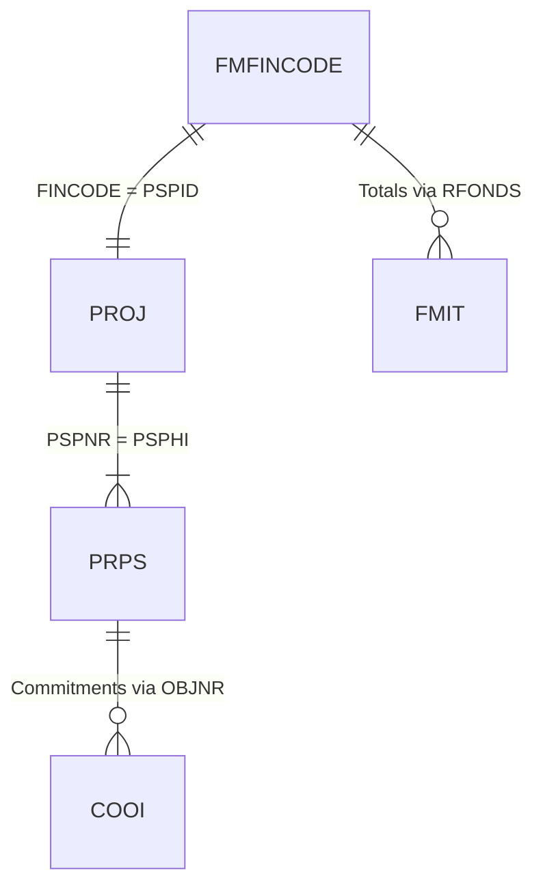
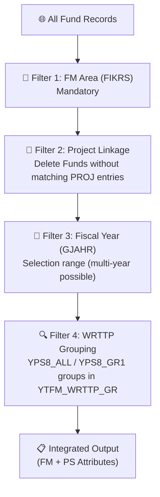
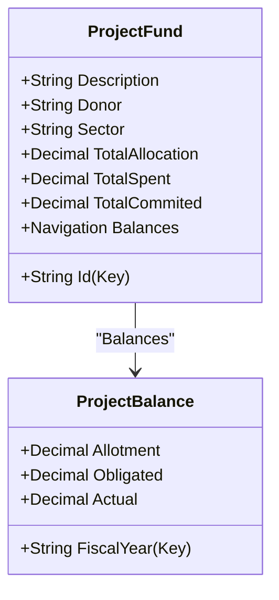

# Technical Analysis: YPS8 Integrated FM-PS Report

## Overview
- **Transaction**: `YPS8`
- **Underlying Program**: `YPS8_BCS_V2` (Package `YE`)
- **Core Business Logic Class**: `YCL_YPS8_BCS_BL` (Package `YE`)
- **Primary Purpose**: Provides an integrated view of Funds Management (FM) and Project System (PS) data, specifically designed for non-Regular Budget (non-RB) project monitoring.

### Related Transactions (Landscape)

| Transaction | Program | Relationship | Notes |
| :--- | :--- | :--- | :--- |
| `YFM1` | `YFM1_BCS_V3` | Sibling | Focuses on Regular Budget (RB) funds using FM totals. |
| `YPS8` | `YPS8_BCS_V2` | **This report** | Focuses on non-RB projects by bridging FM funds and PS WBS elements. |
| `CJW1` | Standard | Standard SAP | Project Budgeting — shows budget at WBS level. |
| `S_ALR_87013531` | Standard | Standard SAP | Actual/Commitment/Total/Plan in Project System. |

## Discovery Protocol (Backend-First)
1. **Object Inventory**: Queried `TADIR` for `YPS8*` objects in package `YE` and `YB`.
2. **Logic Extraction**: Used `SIW_RFC_READ_REPORT` via Python RFC to download all method includes of `YCL_YPS8_BCS_BL`.
3. **Architecture Mapping**: Analyzed the join logic between `FMFINCODE`, `PROJ`, and `PRPS` to verify the UNESCO-specific master data alignment.

## Technical Components

### 1. ABAP Program: `YPS8_BCS_V2`
A wrapper program that:
1. Defines the selection screen (`YPS8_BCS_V2_SEL`).
2. Instantiates `YCL_YPS8_BCS_BL`.
3. Passes selection criteria to the class via `SET_SELECTION_VALUES`.
4. Triggers `GET_DATA` and `DISPLAY_ALV`.

### 2. Core Class: `YCL_YPS8_BCS_BL`
Encapsulates the integration logic.

#### Key Methods:
- `READ_FMFINCODE`: Selects funds based on FM Area and Fiscal Year. Join with `PROJ` on `FINCODE = PSPID` to get the internal project ID (`PSPNR`).
- `READ_PROJECT`: Selects project/WBS metadata from `PROJ` and `PRPS` using the `PSPNR` from the fund.
- `READ_FMBDT`, `READ_FMIT`: Retrieves FM budget and totals.
- `COMPUTE_AMOUNTS`: Calculates utilization rates and balances.
- `GET_EXCHANGE_RATE`: Handles currency conversion to USD if requested.

#### Entity Relationship (FM to PS Link)
The critical link used for non-RB funds control:
1. **`FMFINCODE-FINCODE`** (FM Fund ID) ↔ **`PROJ-PSPID`** (PS Project Definition ID)
2. **`PROJ-PSPNR`** (Internal Project ID) ↔ **`PRPS-PSPHI`** (Link to WBS)
3. **`PRPS-POSID`** (WBS Element ID) usually matches **`PROJ-PSPID`** at level 1.

## Report Specification & Calculation Logic

### 0. Business Scope Filters (Filter Chain)

> [!IMPORTANT]
> Unlike `YFM1` which filters for Regular Budget, `YPS8` filters for funds that have a matching PS Project. This indicates it is the primary report for **Project-based (non-RB)** activities.

### 1. Selection Criteria (Input Parameters)

| Parameter | Technical Field | Mandatory | Business Meaning |
| :--- | :--- | :--- | :--- |
| **FM Area** | `FIKRS` | Yes | Defaults to 'UNES'. |
| **Fund** | `RFUND` | No | Selection range for funds/projects. |
| **Fiscal Year** | `GJAHR` | No | Multiple years allowed (unlike YFM1). |
| **Donor** | `PRPS-YYE_DONOR` | No | Custom PS field for non-RB donor filtering. |
| **Sector** | `PRPS-USR02` | No | UNESCO Sector classification. |
| **Currency Conv** | `P_CONV` | No | If checked, converts all amounts to USD. |

### 2. Output Framework (ALV Columns)

| # | Column Label | Technical Basis | Grouping | Description |
| :---: | :--- | :--- | :--- | :--- |
| A | **Fund / Project** | `FINCODE` | Key | The Fund and Project Definition ID (matched). |
| B | **Project Text** | `PROJ-POST1` | Enrichment | Name of the project. |
| C | **Sector / Div** | `USR02`, `USR03` | Enrichment | UNESCO organizational attributes from PRPS. |
| D | **Donor** | `YYE_DONOR` | Enrichment | The funding donor. |
| E | **Total Allocation**| `ALLOC_TOTAL` | Calculation | Total budget allocated to the project. |
| F | **Allotment Curr** | `ALLOT_CURR` | Calculation | Alotted amount for the selected periods. |
| G | **Obligated** | `OBLIG_CURR` | Calculation | Commitments (Travel, PO, etc.) |
| H | **Actual** | `ACTUAL_CURR` | Calculation | Real expenditure (Invoices). |
| I | **Utilization %** | `RATE_CURR_1` | Calculation | `Actual / Allotment` percentage. |

### 3. Calculation Engine

#### **A. Value Type Grouping**
The report uses two specific groups from `YTFM_WRTTP_GR`:
- `YPS8_ALL`: Defines the total scope of relevant value types for the report.
- `YPS8_GR1`: Specific subset for period-based conversion/accumulation.

#### **B. Period Handling**
`YPS8` handles carry-forward (`HSLVT`) explicitly, which is crucial for multi-year projects where unspent funds from the previous year are rolled over.

#### **C. Signal Conventions**
Follows standard FMIT conventions but adds logic for `REVENUE` items which are specifically excluded or handled separately in `SUM_HSL_AMOUNTS` to ensure they don't distort the expenditure view.

## EDM - OData Logical View (Proposed)

Designed for a unified "Project Dashboard" service.

## Significance for UNESCO Architecture
The `YPS8` report confirms that:
1. **PS is the Source of Truth** for project structure and donor attributes for non-RB funds.
2. **FM is the Source of Truth** for the actual financial balances.
3. The **Linkage** is purely naming-convention based (`FINCODE` = `PSPID`), which must be maintained in any automated object creation or integration service.

---
*Created as part of the YPS8 Technical Analysis protocol.*
