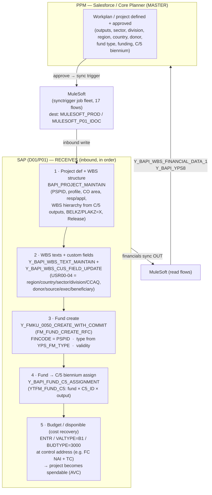

# E2E Flow — PPM/Salesforce → SAP (project + fund), as the integration does it

**Master of record = PPM (Salesforce / Core Planner).** SAP RECEIVES projects + funds; it does NOT originate
them. The transport is **MuleSoft** (a "synctrigger" background-job fleet — 17 distinct flows; visible in
TBTCO job discovery). SAP then serves financials back OUT to PPM. (Source: system_operating_model_rfc.md.)

## Step detail (the exact contract)

| # | Step | FM (inbound MuleSoft→SAP) | Key data |
|---|------|---------------------------|----------|
| 1 | Project + WBS structure | **`BAPI_PROJECT_MAINTAIN`** | PSPID, PROJECT_PROFILE, COMP_CODE/CONTROLLING_AREA/BUS_AREA, RESPONSIBLE_NO (TCJ04), APPLICANT_NO (TCJ05); WBS w/ `WBS_ACCOUNT_ASSIGNMENT_ELEMENT=X`+`WBS_PLANNING_ELEMENT=X`; hierarchy via `I_WBS_HIERARCHIE_TABLE`; then Release (REL). REFNUMBER = per-data-table row index. |
| 2 | WBS texts + custom fields | `Y_BAPI_WBS_TEXT_MAINTAIN`, `Y_BAPI_WBS_CUS_FIELD_UPDATE` | USR00=REGION, USR01=COUNTRY, USR02=SECTOR, USR03=DIVISION, USR04≈CCAQ; YYE_DONOR, YYE_TYP_SOU (source), YYE_EXEC, YYE_BENEF1 (sister/beneficiary). |
| 3 | Fund create | **`Y_FMKU_0050_CREATE_WITH_COMMIT`** (→ FM_FUND_CREATE_RFC) | **FINCODE = PSPID** (the 10-digit link); fund TYPE via YPS_FM_TYPE correlation; DATAB/DATBIS from workplan validity. |
| 4 | Fund → C/5 biennium | **`Y_BAPI_FUND_C5_ASSIGNMENT`** | Writes YTFM_FUND_C5 (FIKRS, FINCODE, C5_ID e.g. 43=2026-27, FM_OUTPUT). |
| 5 | Disponible (cost recovery) | budget entry (ENTR / VALTYPE B1 / BUDTYPE 3000) | At the control address (fund center e.g. NAI + commitment item TC); makes the project spendable under AVC (RIB). See cost_recovery_avc_disponible_model.md. |
| ← | Financials back to PPM | `Y_BAPI_WBS_FINANCIAL_DATA_1`, `Y_BAPI_YPS8` | SAP returns project financials (budget/commitment/actual) to PPM for monitoring. |

## Invariants
- **FINCODE = PSPID** (project ⇔ fund, 10-digit naming link). When a project is created a matching fund is provisioned.
- **PPM is master**; never create projects/funds standalone in SAP for production — they must originate in PPM.
- WBS hierarchy IS created via `BAPI_PROJECT_MAINTAIN` (MuleSoft does it daily) → nesting is achievable via the
  BAPI; reproduce the `I_WBS_HIERARCHIE_TABLE` payload MuleSoft sends.

## How our manual D01 replica maps to this flow
Steps 1–4 = the FM master sync + project/WBS create we ran (`fund_*`, `ps_project_sync.py`); step 5 = the
disponible we posted (`budget_assign_entr.py`). Replicating a project for a TEST = run this same flow for one
PSPID. For the canonical/automated path, drive `BAPI_PROJECT_MAINTAIN` with the MuleSoft payload shape (incl.
the hierarchy table) rather than hand-building.

## Open (to make it byte-exact)
Capture the actual MuleSoft request payloads (SOAMANAGER logical ports / the unescore20-PPM-brain integration
artifacts) to lock the exact field mapping + the `I_WBS_HIERARCHIE_TABLE` population for nested WBS.
