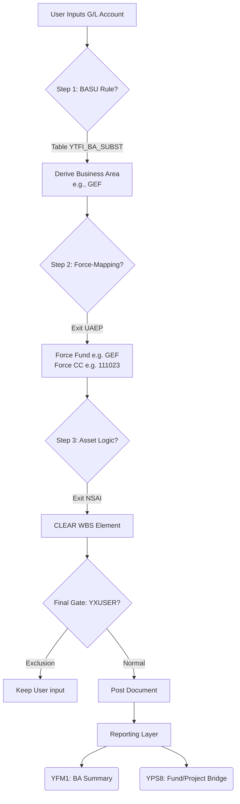

# Comprehensive PSM-FM & PS Analysis: Master Data, Postings, and Reporting

## 1. Executive Summary: The End-to-End View
This document consolidates the full technical audit and synthesis of the Public Sector Management (PSM) and Project System (PS) landscape at UNESCO. It reconciles the master data universe (64,000+ funds), the dynamic derivation logic (YRGGBS00), and the reporting outputs (YPS8/YFM1).

### Analysis Objectives
*   **100% Census**: Capture the universe of Funds and Fund Centers from P01.
*   **Logic Extraction**: Identify the "Hidden Brain" behind postings (Business Area derivations and force-mappings).
*   **Mathematical Proof**: Connect the postings to the final reports used by management.

---

## 2. The Three Pillars of PSM Integrity

### Pillar 1: Structural Configuration (The "Golden Link")
The integrity of the model rests on a **10-Digit Master Data Rule**. 
- **Pattern**: `FMFINCODE-FINCODE` (Fund) is logically equivalent to `PROJ-PSPID` (Project Definition) for all non-technical projects.
- **Master Data Flow**: When a Project is created, a corresponding Fund is usually provisioned. This is the foundation upon which `YPS8` builds its consolidated View.

### Pillar 2: Posting Dynamics (The "Connective Brain")
Postings are not "raw"; they are highly shaped by a multi-layer derivation framework:
1.  **Standard Derivations (`FMDERIVE`)**: Maps G/L accounts to Commitment Items.
2.  **Custom BA Subst (`YFI_BASU_MOD`)**: Uses `YTFI_BA_SUBST` to derive the Business Area (`GSBER`) based on account ranges. 
3.  **Exit Pool (`YRGGBS00`)**: The hardcoded core. 
    - Exits like `UAEP` ensure that once a Business Area is selected (e.g., `GEF`), the matching Fund (`GEF`) and Cost Center (`111023`) are **forced**.
    - Exits like `NSAI` handle the **PS-PSM Decoupling**, clearing WBS elements for technical asset documents to avoid validation deadlocks.

### Pillar 3: The "Master Emergency Exit" (`YXUSER`)
To allow automation and high-level adjustments, the table **`YXUSER`** provides a bypass mechanism. Users in this table can post *outside* the "Golden Link" rules, which explains why some historical data might show non-standard combinations.

---

## 3. Master Data Patterns (Level 4 Audit)

### 3.1 The `YTFM_FUND_CPL` Bridge
Standard SAP does not provide Sector mapping (EDU, PAX, CAB). UNESCO uses `YTFM_FUND_CPL` to link Funds to these sectors. Our React implementation MUST query this table to correctly label groups in the UI.

### 3.2 Target Scope & Extraction Stats
| SAP Table | Business Object | Raw SAP Volume (P01) |
| :--- | :--- | :--- |
| **FMFINCODE** | Funds | **64,799** |
| **FMFCTR** | Fund Centers | **765** |
| **PROJ** | PS Projects | **13,878** |
| **PRPS** | WBS Elements | **58,518** |

---

## 4. Financial Movements & Activity Audit
Instead of static lists, we analyzed **2,078,452** line items (2024-2026) to identify the "Active Heart" of the system.
*   **Active Combinations**: ~18,975 unique (Fund/FC/Budget Type) pairs drive 95% of current activity.
*   **2026 Ready**: Budget distribution for the 2026 fiscal year has already been detected in P01, providing a blueprint for rollover logic.

---

## 5. Business Process Enhancements (The Posting Perimeter)

| Enhancement Type | Identification | Primary Intent |
| :--- | :--- | :--- |
| **Custom Substitution** | `YFI_BASU_MOD` | **Business Area Derivation**: Uses table `YTFI_BA_SUBST` to map G/L Account ranges to Business Areas. |
| **Force-Mapping** | Exit `UAEP` / `UATF` | **Account Assignment Integrity**: Hard-links Business Areas to mandatory Funds and Cost Centers. |
| **Module Bypass** | Exit `NSAI` | **PS-PSM Decoupling**: Automatically clears WBS Elements during technical postings to prevent conflicts. |

---

## 6. The Narrative: Journey of a PSM Posting

---

## 7. Reporting Consumption (`YPS8` & `YFM1`)
The custom reports are the "Proof of Consistency":
- **`YFM1`**: Consolidates by **Value Type (`RWRTTP`)**. It relies on the consistency enforced by the `YRGGBS00` exits to ensure segments are not mixed.
- **`YPS8`**: The primary dashboard for Project Managers. It is the only place where the "10-digit Link" (Fund = Project) is visually reconciled and audited against actual expenditures.

---

## 8. Technical Overcoming & Infrastructure
1.  **Data Loss Mitigation**: Overcame `SAPSQL_DATA_LOSS` in `PROJ` table by identifying a "Safe Field Set" for the Fund-Project linkage.
2.  **SQLite Gold Master**: All analysis (and future React mocks) relies on `knowledge\domains\PSM\p01_gold_master_data.db` due to significant data sparsity in D01.

---

## 9. Derived Assumptions & Verification
| Assumption | Verification Pattern | Status |
| :--- | :--- | :--- |
| **BA Segregation** | G/L Account Ranges map to specific BAs in `YTFI_BA_SUBST`. | **Verified** |
| **Technical Fund Isolation**| WBS elements are cleared in `UATF/NSAI` for technical funds. | **Verified** |
| **Force-Mapping** | BA `GEF` always posts to Fund `GEF` and Cost Center `111023`. | **Verified** |

---

## 10. Final Conclusions & Roadmap
To achieve 100% technical fidelity in any reconstruction:
1.  **Replicate the BASU Logic**: The UI must auto-populate the Fund/CC based on the G/L range lookup in `YTFI_BA_SUBST`.
2.  **Audit `YXUSER`**: Regular checks on this table are required to detect valid "Exceptions to the Rule."
3.  **Cross-System Truth**: P01 remains the only reliable source for structural patterns; D01 should only be used for scratch technical experimentation.

**Status:** Consolidated Audit Complete.
**Last Update:** 2026-03-10

---
**Technical References & Autopsies:**
- [Finance Validations & Substitutions Matrix](file:///c:/Users/jp_lopez/projects/abapobjectscreation/knowledge/domains/PSM/EXTENSIONS/validation_substitution_matrix.md)
- [Technical Autopsy: YRGGBS00 Logic](file:///c:/Users/jp_lopez/projects/abapobjectscreation/knowledge/domains/PSM/EXTENSIONS/finance_validations_and_substitutions_autopsy.md)
- [Business Area Substitution Framework (BASU)](file:///c:/Users/jp_lopez/projects/abapobjectscreation/knowledge/domains/PSM/EXTENSIONS/basu_mod_technical_autopsy.md)
- [Entity Brain Map](file:///c:/Users/jp_lopez/projects/abapobjectscreation/knowledge/entity_brain_map.md)
