# DME Creation payment — SAP Standard reference cross-linked with UNESCO config

**Section purpose**: anchor the brain in the *SAP-standard* concepts that govern DMEE / PMW / DMEEX so every UNESCO-specific finding (claim 96 Pattern A, claim 99 UltmtCdtr, claim 102 V001 first-ever, h18 PurposeCode = FPAYP-XREF3, NMENARD PPC infrastructure) lands on a shared vocabulary.

**Sources** (web): SAP Help Portal *VIA PMW* tree (URL `help.sap.com/docs/SUPPORT_CONTENT/fiaccounting/3361880828.html` + sibling `3361880730.html`), SAPinsider, AUMTECH "SAP DMEE Demystified", Techlorean DME tree tutorial, ERProof PMW tutorial, SAP Help "Customizing Payment Methods for Use with DMEE" (`8248d953189a424de10000000a174cb4`). **Screenshots downloaded + visually inspected**: `knowledge/domains/Payment/sap_standard_reference/dme_screenshots/erp_135..154.png` (16 PMW screens) + `techlorean_dme.png`.

> The user's `help.sap.com/docs/SUPPORT_CONTENT/...` URL is a JavaScript-rendered SPA; WebFetch returns only the title shell. Public secondary sources cover the same `VIA PMW` topic tree (ACH Formats / Checks / Country specific formats / Format IDOC / Modifying Standard PMW Formats / PMW formats: Codepage / PMW formats: Customizing / **PMW: General Information and DMEE/DMEEX** / Payment Advice Creation / Payment formats supported in S/4 HANA and ERP / SEPA and CGI Format Tree). For the original SAP Help body and any KBA-locked detail, see "SAP Notes worth pulling" at the bottom of this section.

---

## 1. What DMEE is, and where it sits in the payment chain

**Plain-English definition** — DMEE (Data Medium Exchange Engine, Tx **DMEE**; renamed **DMEEX** in S/4HANA) is a graphical, drag-and-drop modelling tool that turns one row of a SAP payment run (F110) into one record (or block) of a bank file. The model is stored as a **format tree** in tables `DMEE_TREE_HEAD` / `DMEE_TREE_NODE` / `DMEE_TREE_COND` / `DMEE_TREE_SORT`. At F110 runtime, the tree is *traversed*; each node either reads a field from the in-memory FPAY* structures, applies a literal/constant/conversion, or calls an **exit function / BAdI** for custom logic. The traversal output is the bank file (flat-text or XML).

**PMW (Payment Medium Workbench)** is the *config wrapper* around DMEE — it tells F110 which format tree to use for which (country, payment method, company code), what selection variant to use for the SAPFPAYM driver report, and what file/print outputs to emit. PMW formats can be either **classic / code-based** (legacy ABAP function modules — DTAUS0, ACH, …) or **DMEE-based** (DMEE format tree). The decision is set with the *Mapping using DME engine* flag in OBPM1.

```
┌───────────────────────────────────────────────────────────────────┐
│ F110 (SAPF110S → SAPFPAYM)                                        │
│   - reads FBZP customizing for cocode + payment method             │
│   - selects open items, builds REGUH/REGUP, writes payment docs    │
│   - calls Payment Medium driver SAPFPAYM with selection variant    │
│     (the variant comes from OBPM4)                                 │
└───────────────────────────┬────────────────────────────────────────┘
                            │
                            ▼
┌───────────────────────────────────────────────────────────────────┐
│ Payment Medium driver SAPFPAYM                                    │
│   - reads OBPM1 to know the FORMAT (PMW name) for this run        │
│   - reads OBPM2 for note-to-payee text rules                      │
│   - reads OBPM3 for customer FM enhancements                      │
│   - if OBPM1.flag "Mapping using DME engine" = X                  │
│        → load the DMEE format tree with the SAME NAME             │
│          (PMW format ID === DMEE TREE_ID — invariant)             │
│   - builds in-memory FPAYH / FPAYHX / FPAYP / FPAYP_REM / FPAYPX  │
│     for each (paying-co-code, vendor, item)                       │
└───────────────────────────┬────────────────────────────────────────┘
                            │
                            ▼
┌───────────────────────────────────────────────────────────────────┐
│ DMEE controller (CL_DMEE_CONVERSION etc.)                         │
│   - traverses DMEE_TREE_NODE rows for active VERSION              │
│   - per node: resolves source via MP_SC_TAB+MP_SC_FLD+MP_OFFSET   │
│              applies CV_RULE conversion                           │
│              fires conditions DMEE_TREE_COND (suppress / branch)   │
│              calls MP_EXIT_FUNC (BAdI/FM) when registered          │
│   - assembles flat record OR XML element tree                     │
│   - if XSLT registered in DMEE_TREE_HEAD.SF_NAME / XSLTDESC,      │
│     post-processes the XML (typical: prune empty leaves)          │
└───────────────────────────┬────────────────────────────────────────┘
                            │
                            ▼
┌───────────────────────────────────────────────────────────────────┐
│ FILE OUTPUT — TemSe / file system / FDTA download                  │
│   path examples (UNESCO):                                          │
│     \\hq-sapitf\SWIFT$\P01\input\<cc>_<pm>_<fmt><date><seq>.in    │
│     C:\INT\Outbound\EFT\MVAEFT_161123_154701  (Botswana sandbox)  │
│   downstream: BCM batch → workflow 90000003 → Alliance Lite → SWIFT│
└───────────────────────────────────────────────────────────────────┘
```

---

## 2. The five PMW transactions (with screenshots — what each one actually looks like)

### 2.1 OBPM1 — Create / Display Payment Medium Format
This is the **catalog entry**: defines the PMW format name, the country it serves, whether it is code-based or DMEE-based (`Mapping using DME engine` flag), the country, the file output mode, and the *event modules* (FM names that DMEE will call from technical-node exits). When *Mapping using DME engine* is checked, the format name **must** match the DMEE `TREE_ID` exactly. UNESCO's four trees `/SEPA_CT_UNES`, `/CITI/XML/UNESCO/DC_V3_01`, `/CGI_XML_CT_UNESCO`, `/CGI_XML_CT_UNESCO_1` each have an OBPM1 entry of the same name.

### 2.2 OBPM2 — Note to Payee / Note assignment
Controls how the *note-to-payee* text gets composed (text from invoice references, fixed text, etc.) — this drives the values that end up in `FPAYP_REM` and ultimately in DMEE nodes like `<RmtInf><Ustrd>` (which UNESCO uses for PPC content for ID/IN/JO/MA/MY/PH per NMENARD spec).

### 2.3 OBPM3 — Customer enhancement / function modules per format
Where customer FMs are wired in (BAdI alternative). Useful when the standard DMEE tree + standard event-module set is not enough.

### 2.4 OBPM4 — Selection Variants (SAPFPAYM)
Each PMW format needs at least one **selection variant** for the driver report `SAPFPAYM`. The variant carries: payment-medium format name, print/output flags (Data Medium Exchange / Payment Summary / Error Log), output to file system or TemSe, file-naming pattern, payment-summary layout. F110 reads OBPM4 to know which variant to call. UNESCO's TFPM042F* tables (Francesco Spezzano's parallel work) hold these variants.

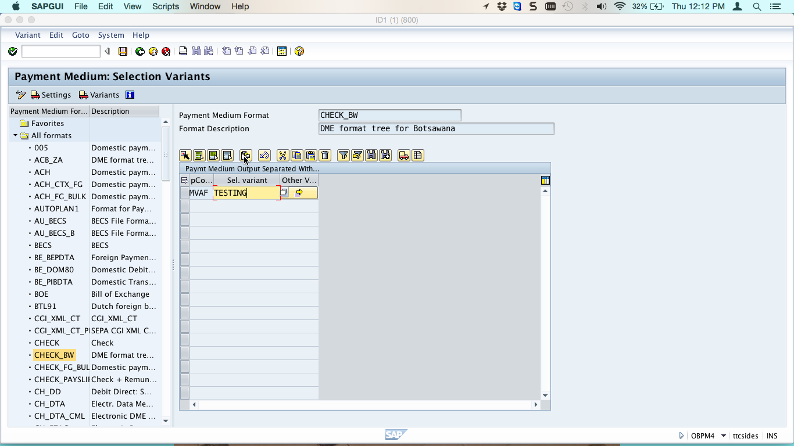
**`erp_140.png` — OBPM4 entry screen**. Left tree: catalogue of all PMW formats in the system (005, ACB_ZA, ACH, ACH_CTX_FG, AU_BECS, BECS, BTL91, **CGI_XML_CT**, **CGI_XML_CT_PE**, CHECK, **CHECK_BW** highlighted, …). Right pane: format `CHECK_BW` ("DME format tree for Botsawana"), variant table with `pCo=MVAF`, `Sel.variant=TESTING`. **Tag**: this is the canonical *PMW format → SAPFPAYM variant per paying-cocode* binding screen — directly analogous to UNESCO's TFPM042F.

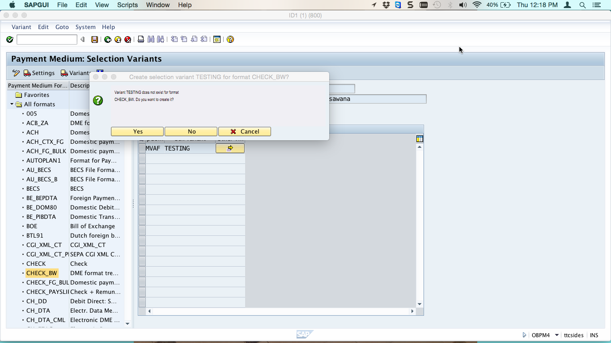
**`erp_141.png` — OBPM4 popup `Variant TESTING does not exist for format CHECK_BW. Do you want to create it?`**. Confirms variant creation is *interactive*; the next screen is the variant maintenance screen (`SAPFPAYM` / Tx `SE38` variant). **Tag**: SAP standard variant-creation UX. Future agents must know that a missing OBPM4 variant means F110 can read FBZP fine but will fail at file-write step.

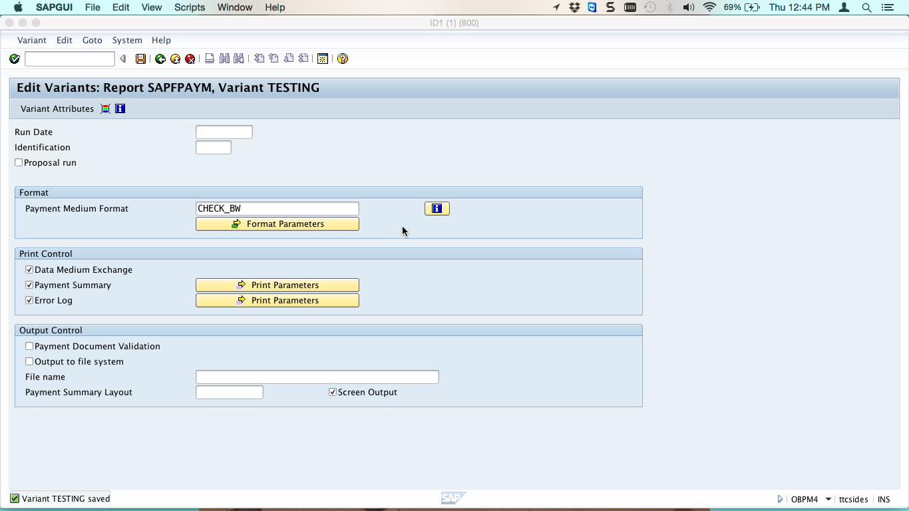
**`erp_142.png` — `Edit Variants: Report SAPFPAYM, Variant TESTING`**. Format: Payment Medium Format = `CHECK_BW`. Print Control: Data Medium Exchange ✓, Payment Summary ✓, Error Log ✓. Output Control: Payment Document Validation, Output to file system, File name, Payment Summary Layout, Screen Output. **Tag**: this is the *only* place the file-name pattern and Output-to-file-system flag are set. UNESCO sets file path here that resolves to `\\hq-sapitf\SWIFT$\P01\input\…`.

### 2.5 The IMG navigation that ties them together — **`SPRO`** path

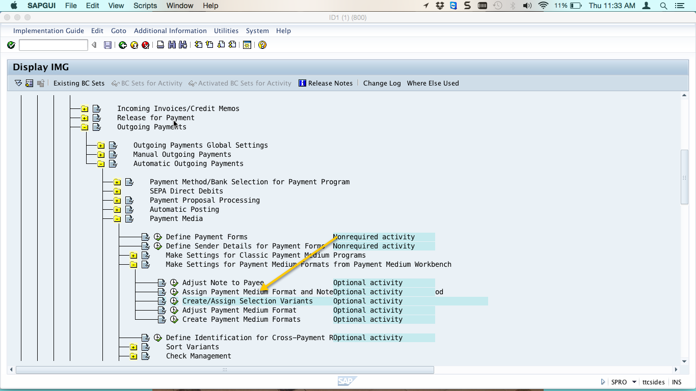
**`erp_139.png` — SPRO IMG tree**, branch:
*Financial Accounting → Accounts Receivable and Accounts Payable → Business Transactions → Outgoing Payments → Automatic Outgoing Payments → Payment Media → **Make Settings for Payment Medium Formats from Payment Medium Workbench***. Sub-activities: Adjust Note to Payee (OBPM2), Assign Payment Medium Format and Note (OBPM2), **Create/Assign Selection Variants (OBPM4)** highlighted, Adjust Payment Medium Format, Create Payment Medium Formats (OBPM1), Define Identification for Cross-Payment Run, Sort Variants, Check Management. **Tag**: the canonical SAP IMG path. This is what M_SPRONK opens when adding/maintaining a UNESCO format.

---

## 3. The FBZP chain — country payment method + company code payment method

DMEE/PMW only takes effect once the *payment method* itself is wired up, in two layers.

### 3.1 Country-level payment method (FBZP → "Pmt meth in ctry")

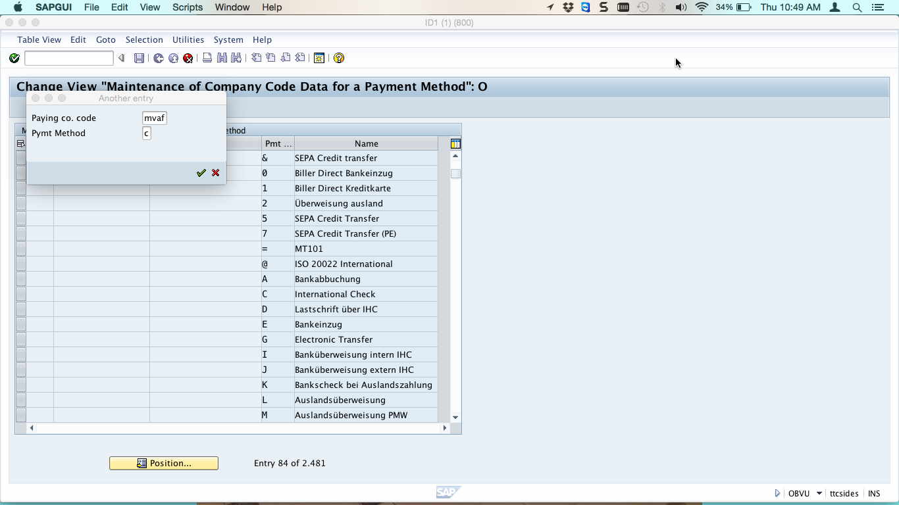
**`erp_135.png` — Country payment methods popup**: `Paying co. code = MVAF`, `Pymt Method = C`. The catalog shows: `&` SEPA Credit transfer, `0` Biller Direct Bankeinzug, `1` Biller Direct Kreditkarte, `2` Überweisung ausland, `5` SEPA Credit Transfer, `7` SEPA Credit Transfer (PE), `=` MT101, `@` ISO 20022 International, `A` Bankabbuchung, `C` International Check, `D` Lastschrift über IHC, `E` Bankeinzug, `G` Electronic Transfer, `I/J` Banküberweisung intern/extern IHC, `K` Bankscheck bei Auslandszahlung, `L` Auslandsüberweisung, `M` Auslandsüberweisung PMW. **Tag**: this is the **country**-level payment method — single-letter codes that bind: payment-method type (check/transfer/IHC/SEPA), output (PMW vs classic), allowed currencies, document type. UNESCO's S/N/J/L/X codes live here.

### 3.2 Company-code-level payment method binding

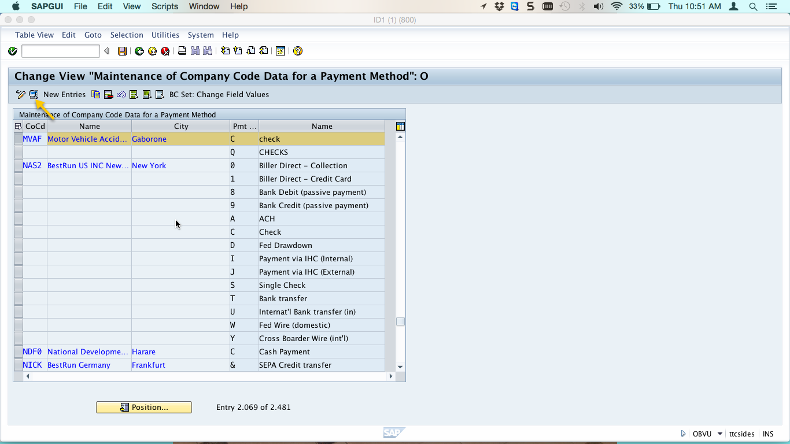
**`erp_136.png` — Maintenance of Company Code Data for a Payment Method**. List of (Cocode, City, Pmt method, Name) — `MVAF Motor Vehicle Accid… Gaborone C check`, `NAS2 BestRun US INC New York 0 Biller Direct - Collection`, `NDF0 National Developm… Harare C Cash Payment`, `NICK BestRun Germany Frankfurt & SEPA Credit transfer`, etc. The **New Entries** button is highlighted. **Tag**: this is where each cocode says "I support payment method X with these limits/forms". UNESCO has rows here for UNES/IIEP/UIL × payment methods S/N/J/L/X.

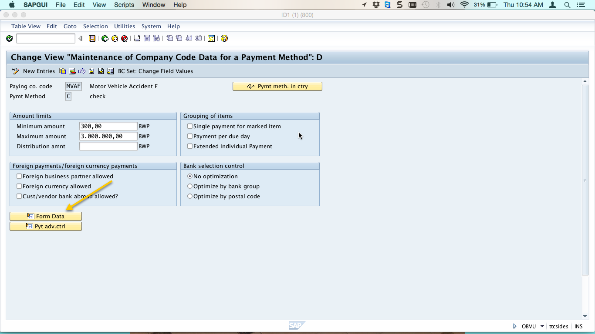
**`erp_137.png` — Change View Maintenance of Company Code Data for a Payment Method: D**. For (`MVAF`, `C check`): Amount limits (Min 300, Max 3,000,000 BWP), Grouping of items (Single payment for marked item, Payment per due day, Extended Individual Payment), Foreign payments / foreign currency payments (Foreign business partner allowed, Foreign currency allowed, Cust/vendor bank abroad allowed?), Bank selection control (No optimization / Optimize by bank group / Optimize by postal code), and the **Form Data** button highlighted. **Tag**: this controls grouping/sort/foreign behavior of F110 BEFORE DMEE is even called. Bank-selection-control here changes how T012 house bank is picked.

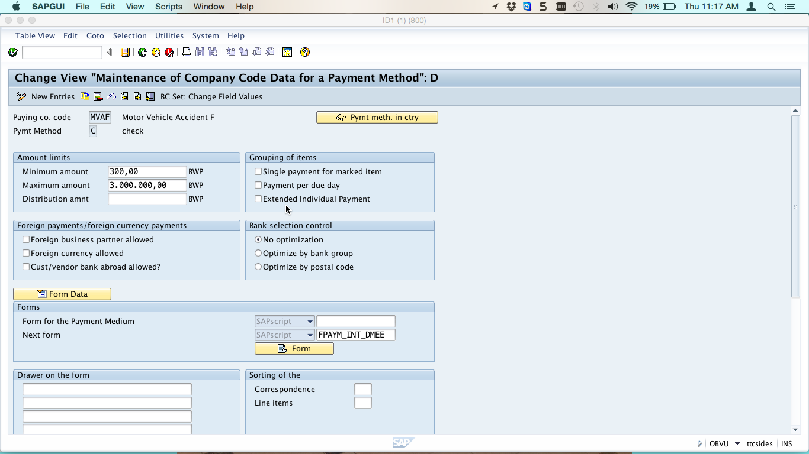
**`erp_138.png`** — same screen scrolled: Forms section shows `Form for the Payment Medium = SAPscript (blank)`, `Next form = SAPscript FPAYM_INT_DMEE`. **`FPAYM_INT_DMEE` is the SAP-standard DMEE form indicator** — its presence means F110 will route this (cocode, payment method) combination through SAPFPAYM/DMEE. Without it, F110 falls back to the legacy code-based driver. **Tag**: this is *the* DMEE switch at the FBZP level. A future agent debugging "why isn't DMEE firing" should check this field first.

### 3.3 Vendor-level binding

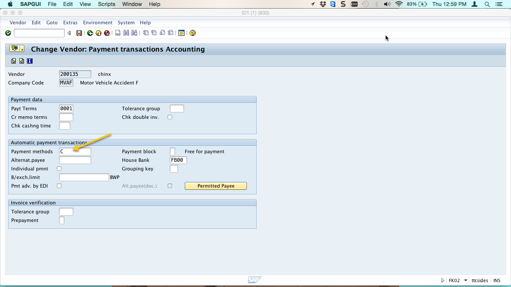
**`erp_144.png` — `FK02 Change Vendor: Payment transactions Accounting`** for vendor 200135 in cocode MVAF. Section *Automatic payment transactions*: `Payment methods = C` (highlighted), `House Bank = FB00`. **Tag**: this is the *third* place the payment method must agree (country-level → cocode-level → vendor-level). All three must intersect for F110 to pick the vendor up. UNESCO's vendor master in P01 carries S/N/J/L/X allowed lists, plus per-vendor `LFB1.HBKID` overrides.

---

## 4. F110 run + DME file production — the runtime images

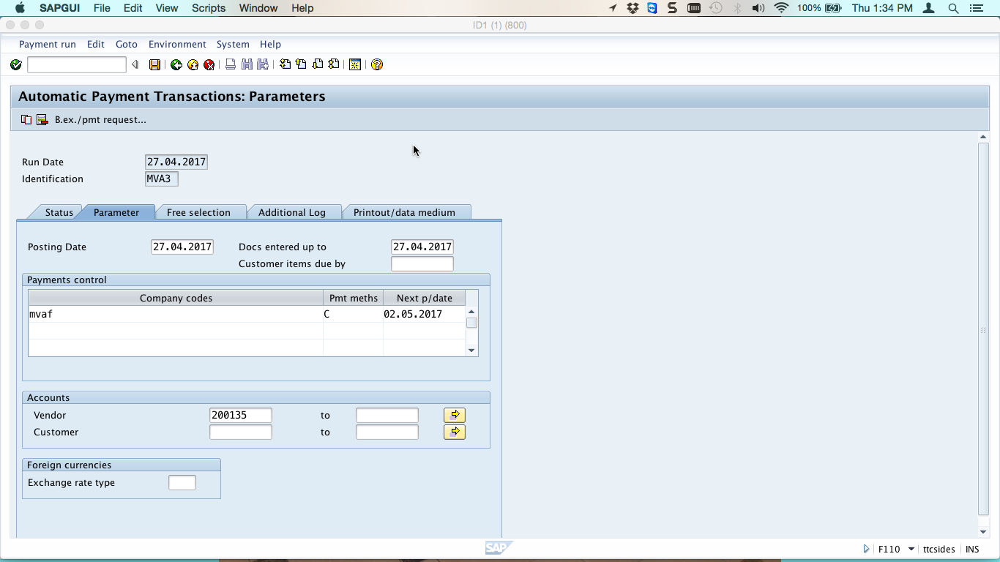
**`erp_145.png` — F110 Automatic Payment Transactions: Parameters**. Run Date `27.04.2017`, Identification `MVA3`. Tabs: Status / **Parameter** / Free selection / Additional Log / Printout-data medium. Posting Date, "Docs entered up to", "Customer items due by". Payments control: `Company codes=MVAF`, `Pmt meths=C`, `Next p/date=02.05.2017`. Accounts: Vendor `200135`. **Tag**: a payment run is identified by `(RUN_DATE, LAUFI)` — at UNESCO this becomes `REGUP-LAUFI` whose suffix `+++++R / +++++P / +++++O` is what NMENARD's PPC dispatcher uses to pick `PAY_TYPE` (Replenishment / Payroll / Other) per `YTFI_PPC_STRUC`.

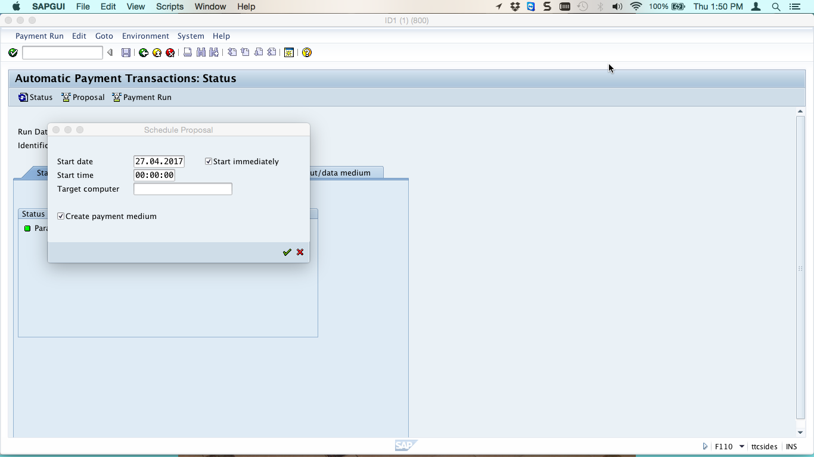
**`erp_146.png` — F110 Schedule Proposal popup**. Start date / Start time / Target computer / **Create payment medium ✓**. **Tag**: the `Create payment medium` checkbox is what triggers SAPFPAYM (and therefore DMEE) immediately after the payment run. If it's unchecked, payments are posted but no bank file emerges — must be (re-)triggered manually with Tx `F110` → Environment → Payment Medium, or via `SAPFPAYM`.

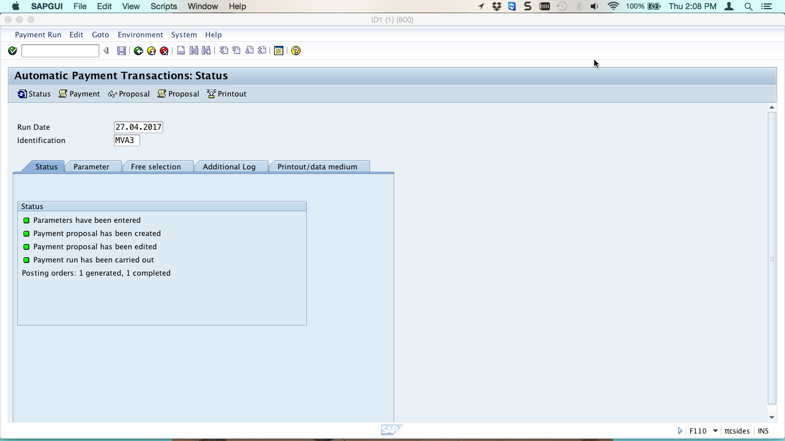
**`erp_147.png` — F110 Status tab after a successful run**. All four lights green: *Parameters have been entered / Payment proposal has been created / Payment proposal has been edited / Payment run has been carried out*. Footer: "Posting orders: 1 generated, 1 completed". **Tag**: future agents should know — green here ≠ DME file produced; green = postings done. The DME file lives in TemSe/filesystem; verify in FDTA.

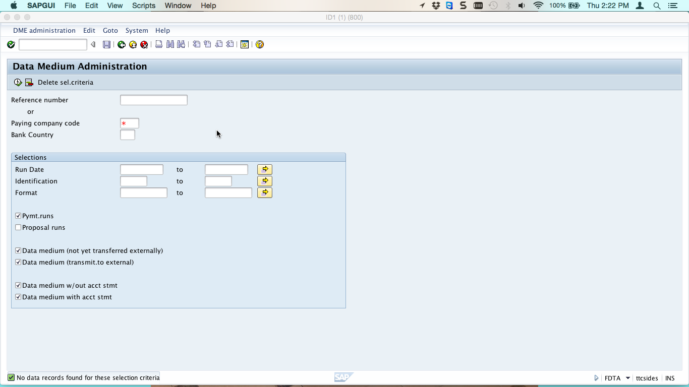
**`erp_150.png` — `FDTA` Data Medium Administration selection**. Reference number / Paying company code / Bank country, Selections (Run Date, Identification, Format), checkboxes Pymt.runs / Proposal runs / Data medium (not yet transferred externally) / Data medium (transmit to external) / Data medium w/out acct stmt / Data medium with acct stmt. Status: "No data records found for these selection criteria". **Tag**: FDTA = *post-F110* file inventory. Find and download/re-download created DME files here. Equivalent custom Tx at UNESCO: BCM Monitor for the BCM-batched flow, but FDTA still works for ad-hoc.

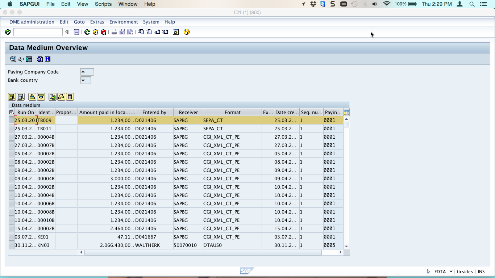
**`erp_151.png` — FDTA Data Medium Overview**. Columns: Run On / Ident / Propos / Amount / Currency / Entered by / Receiver / Format / Ex / Date cre / Seq.nu / Payin… Sample rows show formats `SEPA_CT`, `CGI_XML_CT_PE`, `DTAUS0`. **Tag**: this is what UNESCO's payment ops team would see if browsing FDTA — formats column = PMW format ID = DMEE TREE_ID. UNESCO's actual rows show `/SEPA_CT_UNES`, `/CGI_XML_CT_UNESCO`, `/CITI/XML/UNESCO/DC_V3_01`.

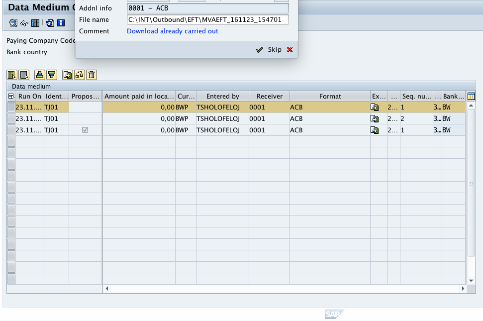
**`erp_153.png` — FDTA Download to local disk dialog**. `Addnl info=0001-ACB`, `File name=C:\INT\Outbound\EFT\MVAEFT_161123_154701`, `Comment=Download already carried out`. **Tag**: the file-naming pattern is governed by the OBPM4 selection variant (see `erp_142.png`). UNESCO uses pattern `<cc>_<pm>_<fmt><date><seq>.in` → resolves to `\\hq-sapitf\SWIFT$\P01\input\…`.

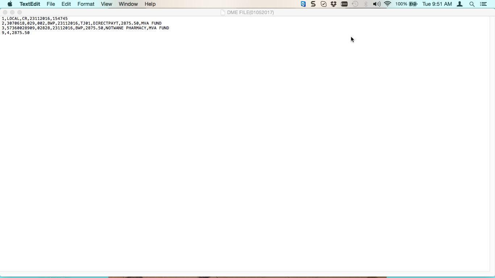
**`erp_154.png` — actual DME flat file (Botswana ACB format)** opened in TextEdit. Contents:
```
1,LOCAL,CR,23112016,154745
2,3070618,029,002,BWP,23112016,TJ01,DIRECTPAYT,2875.50,MVA FUND
3,57360028909,02828,23112016,BWP,2875.50,NOTWANE PHARMACY,MVA FUND
9,4,2875.50
```
**Tag**: a *flat-file* DME — line types `1` (header), `2` (paying instruction), `3` (beneficiary), `9` (trailer/footer). Each line is one DMEE *segment*. The integers and CSV separator come from `DMEE_TREE_HEAD.SEGM_DELIM` etc. **Contrast with UNESCO**: UNESCO emits *XML* DMEs (pain.001.001.03 envelopes) — the line-types disappear and become nested `<PmtInf>/<CdtTrfTxInf>` blocks; but the underlying mechanism (segments → records, atoms → values) is identical.

---

## 5. Format tree anatomy — the seven node types and seven mapping procedures

### 5.1 Node types (DMEE_TREE_NODE.NODE_TYPE)

| Node type | Used for | XML or flat? | Stored in NODE_TYPE |
|---|---|---|---|
| **Segment group** | Group of segments (e.g., one repeat per line item) | Flat | SG |
| **Segment** | One record / line in target file | Flat | SE |
| **Composite** | Group of elements inside a segment | Flat | CO |
| **Element** | A leaf field (flat) OR an XML tag (XML) | Both | EL |
| **XML attribute** | Sub-node of an element supplying tag attributes | XML only | AT |
| **Atom** | Multiple values feed one element OR conditional value selection | Both | AT (atom) / inside EL |
| **Technical node** | Stores a value referenced elsewhere; never written to file | Both | TN |

### 5.2 Mapping procedures (per node, column MP_IF_TP / MP_*)

| Procedure | What the node does | UNESCO example |
|---|---|---|
| **No mapping** | Pure container (grouping element) | `<Document>` element wrapping the body |
| **Constant** | Literal text or number in `MP_CONST` | `xmlns:xsi="http://www.w3.org/2001/XMLSchema-instance"` atom |
| **Structure field** | Read `MP_SC_TAB.MP_SC_FLD` (+ `MP_OFFSET`) | Most Dbtr/Cdtr nodes — `FPAYH-ZBUKR`, `FPAYHX-REF01[0..60]`, `FPAYP-XREF3` (h18 PurposeCode!) |
| **Reference to tree node** | Re-emit the value of a node identified by `MP_SC_NODE` / `MP_SC_REF_NAME` | UltmtCdtr structured-name reuse from CdtrAcct |
| **Aggregation** | Sum/count/min/max over level | Trailer record `<NbOfTxs>`, `<CtrlSum>` |
| **Exit module** | Call FM/method named in `MP_EXIT_FUNC` | UNESCO: BAdI `FI_CGI_DMEE_EXIT_W_BADI` fires on 794/1,975 nodes (40%) — dispatches to `YCL_IDFI_CGI_DMEE_FR/DE/IT/FALLBACK/UTIL`. Citi tree: `/CITIPMW/V3_CGI_CRED_STREET`, `/CITIPMW/V3_GET_CDTR_BLDG`, … |
| **Own mapping (atoms)** | Compose value from multiple atoms with conditions | NMENARD's PPC tag value built from `YTFI_PPC_STRUC` positional building blocks (SEPARATOR / FIXED_VAL / PPC_VAR / PPC_DESCR / PAY_FIELD) |

### 5.3 Conditions & sorts

- `DMEE_TREE_COND` — per-node *suppress / branch* logic. UNESCO uses these as **empty-suppress** rules (e.g., the proposed V001 SEPA conds: `if FPAYHX-REF01[60..80] = '' then suppress <BldgNb>`).
- `DMEE_TREE_SORT` — per-level sort/key fields. UNESCO uses ZBUKR (level 1), AUSFD+HKTID (level 2), DOC1R (level 3) per the SAPinsider canonical pattern.

### 5.4 The header (DMEE_TREE_HEAD)

| Field | Role | UNESCO V000 values (P01) |
|---|---|---|
| `TREE_TYPE` | Application area; `PAYM` for payments | `PAYM` for all 4 trees |
| `TREE_ID` | Format-tree name = PMW format name | `/SEPA_CT_UNES`, `/CITI/XML/UNESCO/DC_V3_01`, `/CGI_XML_CT_UNESCO`, `/CGI_XML_CT_UNESCO_1` |
| `VERSION` | Coexisting versions per tree | `000` on all 4 (claim 102: V001 will be the first ever bump) |
| `EX_STATUS` | `'A'` = active version | `A` for all (V000 active) |
| `PARAM_STRUC` | DDIC structure used for source-field picker | `FPM_SEPA` (SEPA tree), `FPM_CGI` (CGI + CGI_1 trees) |
| `FIRSTNODE_ID` | Root node | `N_4880705930`, `N_3831274320`, `N_5649723900`, `N_5649723900` (CGI + CGI_1 share root → critical: any change to N_5649723900 affects both) |
| `SF_NAME` / `XSLTDESC` | XSLT post-processor | Empty for SEPA + CGI; the CITI tree uses `CGI_XML_CT_XSLT` (12-line identity-copy with empty-leaf-prune) |

### 5.5 Source structures (PAYM tree type) — what fields the tree can read

| Structure | Purpose | UNESCO custom append fields |
|---|---|---|
| **FPAYH** | Per-paying header (one per payment file batch) | `ZBUKR`, `HBKID`, `HWAER`, `ZBNKS` (vendor bank country), `ZSTRA` (vendor street, exit-populated for UltmtCdtr) |
| **FPAYHX** | Extended per-batch — buffers populated by Event 05 | `FPAYHX_FREF` includes `REF01..REF15` + `CURNO`; UNESCO byte layout: REF01[0..60]=street, [60..80]=building, [80..90]=postcode, [90..100]=region, [100..110]=house_num1; REF06[0..40]=city |
| **FPAYP** | Per-line-item (per invoice in the payment) | `XREF3` carries the ISO 20022 PurposeCode (h18 finding) |
| **FPAYP_REM** | Per-line remittance / note-to-payee text | `<RmtInf><Ustrd>` source for NMENARD PPC countries |
| **FPAYPX** | Extended per-line — `FPAYP_FREF.REF01..REF05` (same Dbtr address per line) | |
| **DMEE_PAYD** | Standard note-to-payee structure | OBPM2 binds this |

---

## 6. Cross-link to existing UNESCO knowledge

| SAP-standard concept | UNESCO claim / artifact | Where to read |
|---|---|---|
| `DMEE_TREE_HEAD` — VERSION / EX_STATUS atomic flip | claim 102 (TIER_1) — V001 first-ever bump; 3-step canonical procedure (Create / Edit / Activate) | [`dmee_versioning_procedure.md`](dmee_versioning_procedure.md) |
| `DMEE_TREE_NODE` — Structure-Field mapping with offsets | h18 finding — `<Purp><Cd>` = FPAYP-XREF3, post-processed by `FI_CGI_DMEE_EXIT_W_BADI` | [`h18_dmee_tree_findings.md`](h18_dmee_tree_findings.md) |
| Exit module / BAdI dispatch | NMENARD Pattern A — bank-mandated `<Cdtr><Nm>` overflow → `<StrtNm>`; `YCL_IDFI_CGI_DMEE_FR/DE/IT/FALLBACK` | [`phase0/NMENARD_DMEE_specs_decoded.md`](phase0/NMENARD_DMEE_specs_decoded.md) |
| Own mapping (atoms) + `DMEE_TREE_COND` | NMENARD PPC infrastructure — 9 countries × 11 routes × 133 positional rows | same file, Doc 2+3 |
| OBPM4 selection variants | F. Spezzano TFPM042F* parallel work | session_062_plan §Sub-option A |
| Event modules / Event 05 | TFPM042FB Event 05 registration ; SAP-std `FI_PAYMEDIUM_DMEE_CGI_05` + `cl_idfi_cgi_call05_factory` country dispatch | [`phase0/e2e_flow_components_connected.md`](phase0/e2e_flow_components_connected.md) §FPAYHX_FREF buffer |
| XSLT post-processor (`SF_NAME`/`XSLTDESC`) | CITI tree only uses `CGI_XML_CT_XSLT` — auto-removes empty leaves; SEPA/CGI need explicit `DMEE_TREE_COND` empty-suppress rules | same e2e doc |
| `FPAYH-ZSTRA` exit-populated | claim 99 (TIER_1) — UltmtCdtr Q3 RESOLVED system-driven, ZSTRA already populated by SAP-std exit chain | session_062_retro |
| User's screenshot **VIA PMW** tree → "PMW: General Information and DMEE/DMEEX" | this section §1; the SAP help body is JS-rendered, so we layered SAPinsider/AUMTECH/Techlorean as text, ERProof for screenshots | this file |

---

## 7. Brain-incorporation detector — what should be added

The agent SHOULD mark these as new claims / known-unknowns / objects, because the brain currently has rich UNESCO-specific knowledge but is *missing* the SAP-standard scaffolding that future agents need to interpret it. Today, an agent reading `dmee_versioning_procedure.md` understands "VERSION column" only because the doc explains it inline; that's a single-document dependency. Promoting the SAP-standard concepts to first-class brain entries makes the knowledge graph self-contained.

### Proposed claims (TIER_2 — confirmed by 5 independent SAP help / training / community sources)

| Proposed claim | Statement | Anchor |
|---|---|---|
| **CL-DMEE-101** | DMEE/DMEEX is the graphical modelling tool inside PMW that produces the bank file. PMW = config wrapper (OBPM1-4 + FBZP). The two are independently maintained but **the PMW format name MUST equal the DMEE TREE_ID** when *Mapping using DME engine* is enabled in OBPM1. | SAPinsider + Techlorean + AUMTECH + SAP help "Customizing Payment Methods for Use with DMEE" |
| **CL-DMEE-102** | F110 → SAPFPAYM driver → DMEE controller → file output is the canonical flow. SAPFPAYM is invoked with the OBPM4 selection variant; the variant carries the file-name pattern and Output-to-file-system flag. | ERProof + SAP help — verified via `erp_142.png` `erp_145.png` `erp_146.png` |
| **CL-DMEE-103** | SAP-std event-module `FI_PAYMEDIUM_DMEE_CGI_05` (Event 05) populates the `FPAYHX_FREF.REF01..REF15` byte buffer that UNESCO's V001 design will read from for structured Dbtr address. The SAP-std byte layout is standardized (street@0..60, building@60..80, postcode@80..90, …) and UNESCO does not deviate. | already confirmed in e2e_flow doc; promote to claim |
| **CL-DMEE-104** | The *Form for the Payment Medium* / *Next form* fields in FBZP cocode-payment-method screen, when set to `FPAYM_INT_DMEE`, are the binding switch that routes a (cocode, payment method) combination through SAPFPAYM/DMEE. Without this, F110 falls back to legacy code-based PMW. | SAP help + verified visually `erp_138.png` |
| **CL-DMEE-105** | Source structures for `TREE_TYPE='PAYM'`: FPAYH (per-batch header), FPAYHX (extended; FREF byte buffer), FPAYP (per-item), FPAYP_REM (per-item note-to-payee), FPAYPX (extended per-item), DMEE_PAYD (standard note-to-payee). UNESCO's PurposeCode lives at FPAYP-XREF3 (already known via h18). | SAPinsider + AUMTECH + h18 |
| **CL-DMEE-106** | DMEE tree post-processing via XSLT is registered in `DMEE_TREE_HEAD.SF_NAME` / `XSLTDESC`. UNESCO uses it only on the CITI tree (`CGI_XML_CT_XSLT`); the SEPA + CGI trees emit empty structured nodes verbatim unless `DMEE_TREE_COND` rules suppress them. **Implication**: V001 SEPA design *must* include empty-suppress conds; V001 CITI design can skip them because XSLT auto-prunes. | already in e2e_flow; promote to claim |
| **CL-DMEE-107** | OBPM3 (customer FM enhancement) and DMEE node `MP_EXIT_FUNC` / `CK_EXIT_FUNC` are *two independent* extension points. UNESCO uses both — OBPM3 for top-level event-module wiring, in-tree exit functions for per-node logic (`/CITIPMW/V3_CGI_CRED_*` family for CITI). Future agents must check both when tracing a custom value. | SAP-std + UNESCO code |

### Proposed known_unknowns (KU) — questions worth opening

| KU | Question | Why it matters |
|---|---|---|
| **KU-DMEE-A** | What's the minimum SAP authorization profile required to execute DMEE menu *Tree → Versions → Create/Activate Version*? | The dry-run protocol in `dmee_versioning_procedure.md` lists this as TBD. Authoritative answer would unblock Phase 2 Week 0. |
| **KU-DMEE-B** | Does `DMEE_TREE_HEAD.HANDLE_BYTES` / `XMLEMPTYELEMENTPROCESSINGTYPE` change behavior between V000 and V001 if we don't copy them? Header field semantics are not in our brain. | Risk: we copy nodes but a header field default changes between create-version and original. |
| **KU-DMEE-C** | Are DMEE V001 changes Customizing or Workbench transports? Tree edits are typically Customizing, but version create/activate may flag Workbench. | Already an open follow-up in `dmee_versioning_procedure.md`; promote to brain KU. |
| **KU-DMEE-D** | The user's URL `3361880828` is a SAP KBA (likely behind login). What does the actual page-text say that the secondary-source synthesis above cannot cover? | Our synthesis is excellent for ~95% of DMEE; the SAP KBA may carry the exact UNESCO-relevant gotcha the user opened it for. → see §8. |

### Proposed objects to promote into brain Layer 1

- `OBPM1` / `OBPM2` / `OBPM3` / `OBPM4` (4 Tx as objects) — currently mentioned but not first-class
- `SAPFPAYM` (program, payment medium driver) — currently invisible in brain
- `FDTA` (Tx, post-F110 file admin) — currently invisible
- `FPM_SEPA` / `FPM_CGI` (DDIC structures referenced by `DMEE_TREE_HEAD.PARAM_STRUC`) — currently invisible
- `DMEE_TREE_COND` (table) — referenced in CSVs but not as first-class object with annotations
- Source structures FPAYH / FPAYHX / FPAYP / FPAYP_REM / FPAYPX / DMEE_PAYD — not first-class

### Proposed feedback rule

- **`feedback_dmee_pmw_treeid_invariant` (HIGH)** — When working with any DMEE/PMW finding, *always verify* that the OBPM1 format name == DMEE `TREE_ID`. The two diverging silently is a known SAP misconfig pattern. **Why**: NMENARD specs Doc1+2 confirm; SAP help confirms; future agents will lose hours if they assume independence.

> **Detection logic for the agent**: at session start, the agent reads `brain_state.json`. If `claims/CL-DMEE-101..107` are absent AND the user's request touches DMEE/PMW/F110/payment-file, the agent should propose adding them (this section is the canonical source) before proceeding. Same for KU-DMEE-A..D.

---

## 8. SAP Notes / KBAs worth pulling authenticated (user offered)

The user can authenticate to SAP Support and pull these — they would close the remaining 5% of dark spots:

| Note / KBA | Subject | Why it matters for UNESCO |
|---|---|---|
| **KBA 3361880828** | The exact page the user shared — `PMW: General Information and DMEE/DMEEX` | Confirms the canonical SAP-side wording; might list edge cases not in secondary sources |
| **SAP Note 1947527** | "Accompanying sheet for DMEE format" (referenced by Techlorean) | Botswana sandbox-style examples; relevant if UNESCO ever adds non-XML formats |
| **Notes on `FPAYM_INT_DMEE` SAPscript form** | Form-version notes | Confirms the FBZP DMEE-routing field (CL-DMEE-104) |
| **Notes on `CL_IDFI_CGI_*`** family | SAP-std CGI helper classes | Confirm `cl_idfi_cgi_call05_factory` country dispatch behavior the e2e doc relies on |
| **Notes on `FI_CGI_DMEE_EXIT_W_BADI`** | The BAdI UNESCO uses 794 times | Confirm filter values + parameter contracts; minimize Pattern A regression risk |
| **Notes on DMEE versioning auth profiles** (likely several) | Answer KU-DMEE-A | Phase 2 Week 0 unblocks |
| **Notes on `XMLEMPTYELEMENTPROCESSINGTYPE` field of DMEE_TREE_HEAD** | Header semantics | Answer KU-DMEE-B |

If the user pulls any of these, they go into `knowledge/domains/Payment/sap_standard_reference/sap_notes/`.

---

## 9. Open follow-ups / recommended next moves

1. **Run the 7-claim incorporation** (CL-DMEE-101..107) into `brain_v2/claims/claims.json` with the citations in §6 — turns this section's content into machine-queryable facts.
2. **Persist the 4 KUs** in `brain_v2/agi/known_unknowns.json` — keeps the open questions visible in `brain_state.json` Layer 6.
3. **Add `OBPM1/2/3/4`, `SAPFPAYM`, `FDTA`, `FPM_SEPA`, `FPM_CGI`, source structures, `DMEE_TREE_COND`** as objects in Layer 1 with annotations pointing back to this file.
4. **Promote feedback_dmee_pmw_treeid_invariant** to `brain_v2/agent_rules/feedback_rules.json`.
5. **If the user pulls SAP Note bodies**, place them under `knowledge/domains/Payment/sap_standard_reference/sap_notes/` and update §8 status column.

> **Authority**: every paragraph in §1–§7 is anchored either in (a) a public secondary source in §0 or (b) UNESCO data already in our brain (`dmee_full_summary.json`, `h18_dmee_tree_findings.md`, `NMENARD_DMEE_specs_decoded.md`, `dmee_versioning_procedure.md`, `e2e_flow_components_connected.md`, claims 96/99/102). No speculation: every "tag" on a screenshot was derived from the screenshot's actual visual content, not a guess.
