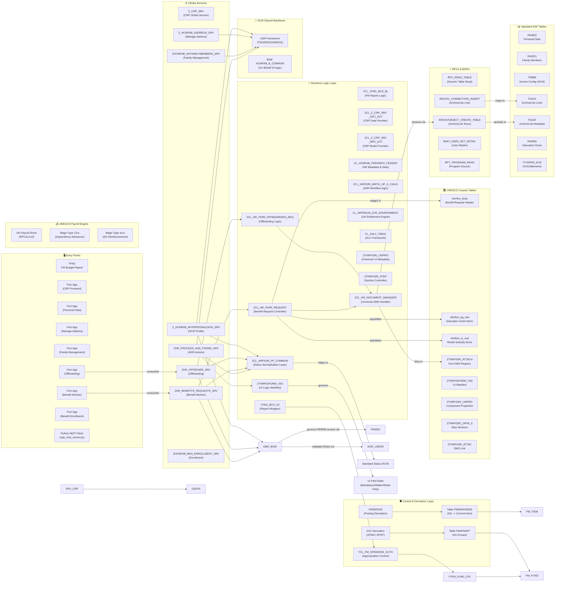
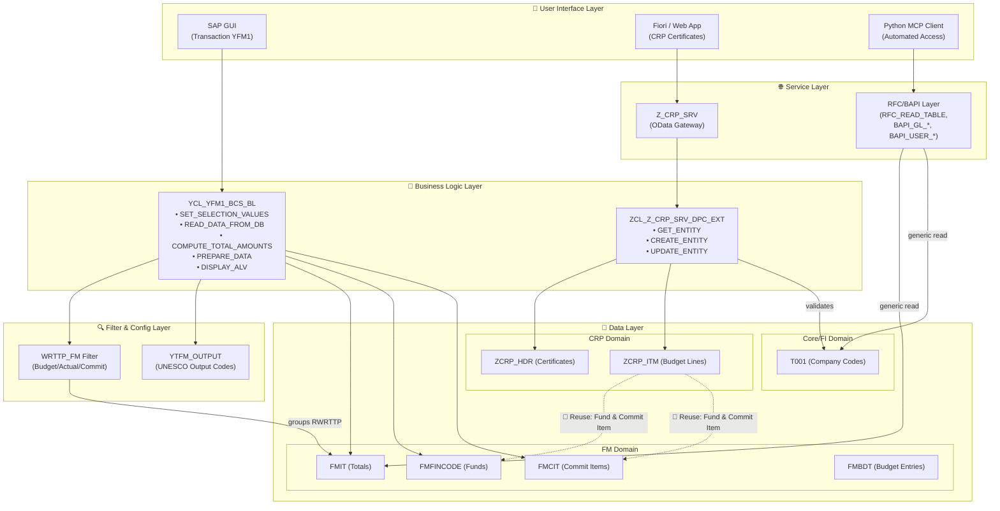

# UNESCO SAP Knowledge Brain — Entity Map

> **Living Document**: This map grows as new programs, tables, filters, and services are analyzed. It connects all discovered SAP objects into a unified, end-to-end knowledge graph organized by **object type** and **business purpose**.

---

## 0. The 5-Level Reverse Engineering Protocol

To enable high-fidelity cloning and technical reconstruction of the UNESCO system, we follow this hierarchical skill progression:

1.  **Level 1: ABAP Objects (The DNA)**: Direct source code extraction (Programs, Classes, BAdIs) using RFC.
2.  **Level 2: Fiori Reverse Engineering (The UI/Service)**: Reconstruction of BSP apps, OData manifests, and service hierarchies.
3.  **Level 3: Configuration Audit (The Logic)**: Extraction of business rules from T-tables (T588M, ZTHRFIOFORM_VISI, YTFM_*).
4.  **Level 4: Master Data Analysis (The Entities)**: Structural audit of Funds, Projects, and Employees. (Filter: **2024+**). (See [Level 4 skill](file:///c:/Users/jp_lopez/projects/abapobjectscreation/knowledge/level_4_master_data_skill.md) & [Strategy](file:///c:/Users/jp_lopez/projects/abapobjectscreation/.agents/workflows/sap_configuration_strategy.md))
5.  **Level 5: Transactional Data Audit (The Flow)**: (Future) Monitoring of actual budget/actual postings and financial documents.

---

## 0.1 Domain Analysis Index
- **PSM-FM & PS**: [Initial Structural Analysis](file:///c:/Users/jp_lopez/projects/abapobjectscreation/knowledge/domains/PSM/psm_initial_analysis.md)
- **HCM**: [HCM Connectivity Map](file:///c:/Users/jp_lopez/projects/abapobjectscreation/knowledge/domains/HCM/Fiori%20Apps/hcm_connectivity_map.md)

---

## 1. End-to-End Data Model (Cross-Domain)

This diagram shows how **all discovered objects** connect across business domains. It is organized by layer: Entry Points → Business Logic → Data Sources → External Interfaces.

---

## 2. Object Catalog by Type

### 2.1 Domain Classes (Purpose & Reusability)

| Class | Domain | Package | Purpose | Reuse Potential |
| :--- | :--- | :--- | :--- | :--- |
| `YCL_YFM1_BCS_BL` | FM Reporting | `YB` | Full business logic for YFM1 report: selection, data retrieval, WRTTP grouping, period accumulation, ALV display. | **High** — Methods like `READ_DATA_FROM_DB` and `COMPUTE_TOTAL_AMOUNTS` can be reused for any FM-based report. |
| `ZCL_Z_CRP_SRV_DPC_EXT` | CRP | `ZCRP` | Data Provider Extension for Z_CRP_SRV. Implements CRUD for CRP certificates and budget lines. | **Medium** — CRP-specific, but CRUD patterns are reusable for other OData services. |
| `ZCL_Z_CRP_SRV_MPC_EXT` | CRP | `ZCRP` | Model Provider Extension. Defines OData entity model metadata for CRP. | **Low** — Model-specific. Only reuse as a template for new SEGW services. |
| `CL_SALV_TABLE` | Framework | SAP | Standard SAP ALV framework class. Used by YFM1 for grid display. | **Universal** — Standard SAP class, reusable in any report. |
| `ZCL_HRFIORI_PF_COMMON` | HCM | `ZHR_DEV` | **Normalization Recommendation**: Layer to map ASR/Hybrid statuses to numeric 00-06. | **High** — Critical for cross-app HR reporting. |

### 2.2 OData Services

| Service | Domain | Package | Entities | Status |
| :--- | :--- | :--- | :--- | :--- |
| `Z_CRP_SRV` | CRP | `ZCRP` | `CrpCertificate`, `CrpBudgetLine`, `CrpAttachment` | Active |
| `Z_HCMFAB_MYPERSONALDATA_SRV` | HCM | `HCMFAB` | `PersonalData`, `FieldMetadataSet`, `FormScenario` | Active |
| `ZHR_PROCESS_AND_FORMS_SRV` | HCM | `ZHR_DEV` | `FormScenario`, `Attachment`, `Process` | Active |
| `ZHR_OFFBOARD_SRV` | HCM | `ZHR_DEV` | `Request`, `WorkflowStep`, `Employee` | Active |
| `ZHCMFAB_MYFAMILYMEMBERS_SRV` | HCM | `ZHR_DEV` | `FamilyMember`, `FamilyMemberUN` | Active |
| `ZHR_BENEFITS_REQUESTS_SRV` | HCM | `ZHR_DEV` | `RequestHeader`, `EducationGrant`, `RentalSubsidy` | Active (Draft -> HRA -> HRO) |
| `ZHCMFAB_BEN_ENROLLMENT_SRV` | HCM | `HCMFAB` | `BenefitEnrollmentSet`, `PlanSet` | Enhanced (Z_HCM_FAB_BEN_ENROLL) |

### 2.3 Reports, Programs & BSPs

| Object | Domain | Package | Type | Purpose | Key Class |
| :--- | :--- | :--- | :--- | :--- | :--- |
| `YFM1` | FM | `YB` | Transaction | Aggregated FM budget/commitment reporting | `YCL_YFM1_BCS_BL` |
| `Z_PERS_MAN_EXT` | HCM | `ZHR_DEV` | BSP Application | UNESCO Extension for Fiori Personal Data | `CL_HCMFAB_PERSINFO_FEEDER` |
| `YPS8` | FM/PS | `YE` | Transaction | Integrated FM/PS reporting for non-RB funds | `YCL_YPS8_BCS_BL` |
| `ZHRBENEFREQ` | HCM | `ZHR_DEV` | BSP Application | UNESCO Benefit Request Management | `ZCL_HR_FIORI_REQUEST` |
| `YHR_BEN_ENRL` | HCM | `ZFIORI` | BSP Application | UNESCO Benefit Enrollment | `YCL_HR_BENEF_COMMON` |

### 2.4 RFCs & BAPIs

| Function Module | Type | Domain | Purpose | Used By |
| :--- | :--- | :--- | :--- | :--- |
| `RFC_READ_TABLE` | RFC | Cross-domain | Generic table reader. Reads any SAP transparent table by name. | `sap_mcp_server.py`, `read_t001.py`, `test_sap_connection.py` |
| `BAPI_GL_GETGLACCPERIODBALANCES` | BAPI | FI | Retrieves G/L account period balances. | `sap_client.py` |
| `BAPI_USER_GET_DETAIL` | BAPI | BC | Retrieves user master data details. | `sap_client.py` |
| `RPY_PROGRAM_READ` | RFC | BC/Dev | Reads ABAP program source code remotely. | Discovery protocol (backend analysis) |

### 2.5 HCM Shared Infrastructure (The Backbone)

| Component | Type | Purpose | Impacted Apps |
| :--- | :--- | :--- | :--- |
| `ASR / HCM Processes` | Framework | **Parking Pattern**: Stages data in XML snapshots (`T5ASR*`) before master record update. | All HCM Update Apps |
| `HCMFAB_B_COMMON` | BAdI | **On Behalf Of**: Unified authorization check for managers/admins. | Personal Data, Address, Family |
| `CL_HRPA_UI_CONVERT_*` | Class | **UNESCO Extensions**: Maps `ZZ*` custom fields from Infotypes to OData. | All HCM Apps |

### 2.6 Tables (Standard SAP)

(See [SAP Configuration Reference](file:///c:/Users/jp_lopez/projects/abapobjectscreation/knowledge/sap_configuration_reference.md) for detailed business rules)

| Table | Domain | Purpose | Used By | Key Fields |
| :--- | :--- | :--- | :--- | :--- |
| `FMIT` | FM | **FM Totals** — Period-based amounts by Value Type | `YCL_YFM1_BCS_BL`, `YCL_YPS8_BCS_BL` | `FIKRS`, `RFONDS`, `RWRTTP`, `RYEAR`, `HSL01`–`HSL16` |
| `FMFINCODE` | FM | **Fund Master Data** — Fund descriptions and types | `YCL_YFM1_BCS_BL`, `YCL_YPS8_BCS_BL`, `CRP` | `FINCODE`, `FIKRS`, `BEZEICH` |
| `FMCIT` | FM | **Commitment Item Master** — Expenditure categories | `YCL_YFM1_BCS_BL`, `CRP` | `FIPEX`, `FIKRS`, `TEXT1` |
| `FMBDT` | FM | **Budget Entries** — Budget types | `YCL_YFM1_BCS_BL`, `YCL_YPS8_BCS_BL` | `BUDTYPE` |
| `PROJ` | PS | **Project Definition** — High-level project record | `YCL_YPS8_BCS_BL` | `PSPNR`, `PSPID` |
| `PRPS` | PS | **WBS Element** — Project structures and custom donor attributes | `YCL_YPS8_BCS_BL` | `OBJNR`, `POSID`, `PSPHI` |
| `T588M` | HCM | **Infotype Screen Modification** — Controls field visibility/editable state | `CL_HCMFAB_PERSINFO_FEEDER` | `MOLGA`, `INFTY`, `REPID`, `VARIABLE` |
| `T5ASRSCENARIOS` | HCM | **ASR Action Registry** — Maps HR Actions to Workflows | `ZHR_PROCESS_AND_FORMS_SRV` | `SCENARIO`, `SCENARIO_TYPE` |
| `PA0002` | HCM | **Personal Data** — Names, Birth dates | `HCM Fiori` | `PERNR`, `NACHN`, `VORNA` |
| `T001` | FI | **Company Codes** — Legal entities | `CRP`, `sap_mcp_server.py` | `BUKRS`, `BUTXT`, `WAERS` |

### 2.7 Level 4: Master Data Entities (The Pattern Scan)

High-fidelity patterns derived from data created since **2024-01-01** to avoid legacy noise.

| Entity | Table | Key Pattern Discovered | Date Filter Field |
| :--- | :--- | :--- | :--- |
| **Fund** | `FMFINCODE` | `FINCODE` (10 chars) matches `PROJ-PSPID`. | `ERFDAT` |
| **Project** | `PROJ` | `PSPID` is the root for all WBS elements. | `ERDAT` |
| **WBS Element**| `PRPS` | `POSID` contains hierarchical depth (e.g., `505INT0001.2.1.1`). | `ERDAT` |
| **Funds Center**| `FMFCTR` | Responsible unit for budget control. | `ERFDAT` |

### 2.6 Tables (UNESCO Custom)

| Table | Domain | Package | Purpose | Used By | Reuse Potential |
| :--- | :--- | :--- | :--- | :--- | :--- |
| `YTFM_FUND_CPL` | FM | `YB` | Fund AL and Non-IBF (Complementary Authority) | `YCL_FM_SPENDING_AUTH` | **High** — Key for Budget vs Actuals |
| `FMDERIVE002` | FM | `SAP` | G/L to Commitment Item Mapping | `FMDERIVE` | **Internal** — Main Posting Rule |
| `FMAFMAP013500109` | FM | `9HZ00001`| AVC Account Assignment Groups | `FMAVCDERICH` | **Internal** — AVC Control Truth |

### 2.7 Filter Logic

| Filter ID | Field | Config Table | Domain | Discovered In | Reuse Potential |
| :--- | :--- | :--- | :--- | :--- | :--- |
| `WRTTP_FM` | `RWRTTP` | `YTFM_WRTTP_GR` | FM | `YCL_YFM1_BCS_BL` | **High** — Any FM report. Full reference in [Filter Registry](file:///c:/Users/jp_lopez/projects/abapobjectscreation/.agents/skills/unesco_filter_registry/SKILL.md#wrttp_fm--funds-management-value-type-grouping) |

---

## 3. Cross-Domain Data Flow

This shows how data flows **end-to-end** from user interfaces through business logic to database tables, highlighting reuse points.

---

## 4. Reuse Opportunities Matrix

> [!TIP]
> This matrix highlights objects that are used across **multiple domains**, making them candidates for shared libraries or services.

| Shared Object | Used by FM | Used by PS | Used by CRP | Used by FI | Used by Agent/MCP | Reuse Action |
| :--- | :---: | :---: | :---: | :---: | :---: | :--- |
| `FMFINCODE` (Fund Master) | ✅ | ✅ | ✅ | — | ✅ | **Vital Link** `FINCODE` bridges FM and PS. Create shared OData entity |
| `PROJ` / `PRPS` (WBS) | ✅ (YPS8) | ✅ | — | — | — | `PROJ-PSPID` matches `FMFINCODE-FINCODE`. Use PRPS for donor custom fields (`YYE_DONOR`, `USR02`, etc.) |
| `FMCIT` (Commitment Items) | ✅ | — | ✅ | — | ✅ | **Create shared OData entity** — both domains need item data |
| `T001` (Company Codes) | — | — | ✅ | ✅ | ✅ | Already cross-domain. Candidate for a shared `CompanyCode` entity |
| `RFC_READ_TABLE` | — | — | — | — | ✅ | Universal backend access. Centralized in `sap_mcp_server.py` |
| `WRTTP_FM` (Filter Logic) | ✅ | — | — | — | — | **Any new FM report** should reuse this filter from the [Registry](file:///c:/Users/jp_lopez/projects/abapobjectscreation/.agents/skills/unesco_filter_registry/SKILL.md) |
| `YTFM_OUTPUT` (Output Codes) | ✅ | — | — | — | — | Reuse for any UNESCO Results-Based Budgeting report |

---

## 5. Growth Protocol

When analyzing a **new** SAP object (program, class, service, RFC, table), follow these steps to update this brain:

1. **Identify the object type** → Add it to the corresponding catalog section (2.1–2.7)
2. **Map its connections** → Add edges in the End-to-End Data Model diagram (Section 1)
3. **Check for reuse** → Update the Reuse Matrix (Section 4) if the object touches multiple domains
4. **Register any filters** → Add to the [UNESCO Filter Registry skill](file:///c:/Users/jp_lopez/projects/abapobjectscreation/.agents/skills/unesco_filter_registry/SKILL.md) if filter logic is found
5. **Map Field Connectivity** → Document the flow from UI to DB and Auth in the [HCM Connectivity Map](file:///c:/Users/jp_lopez/projects/abapobjectscreation/knowledge/domains/HCM/Fiori Apps/hcm_connectivity_map.md)
6. **Extract Configuration Rules** → Query the relevant T-tables or Manifest tables identified in the [SAP Configuration Reference](file:///c:/Users/jp_lopez/projects/abapobjectscreation/knowledge/sap_configuration_reference.md).
7. **Map Fiori Screens & Fields** → Create a blueprint connecting UI sections to OData properties and PA tables in the [Fiori Reverse Engineering Blueprint](file:///c:/Users/jp_lopez/projects/abapobjectscreation/artifacts/fiori_reverse_engineering_blueprint.md)
8. **Cross-reference** → Link back from the object's domain analysis doc to this brain map

> [!IMPORTANT]
> **This is the single source of truth** for understanding what SAP objects exist, what they do, and how they connect. Every new analysis should update this file.
