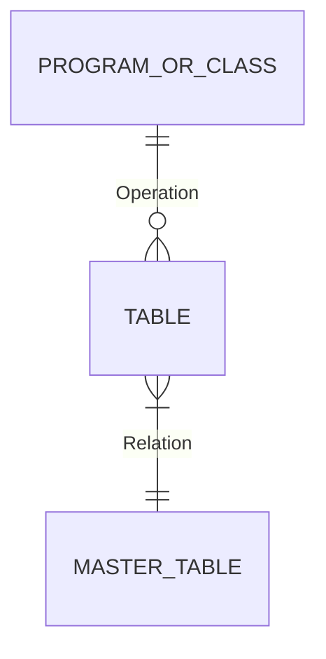
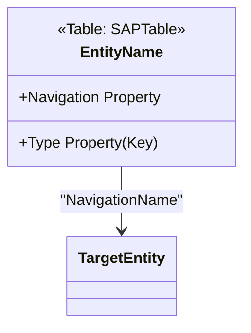

# Technical Analysis Template: [Report Name/TCode]

## Overview
- **Transaction**: [TCode]
- **Underlying Program**: [Program Name] (Package [Package])
- **Core Business Logic Class**: [Class Name] (Package [Package])
- **Primary Purpose**: [Brief description of the business process]

## Discovery Protocol (Backend-First)
> [!IMPORTANT]
> **Real Data Priority**: Always prioritize RFC/Backend metadata over UI observations. Use the following systematic mapping before deep-diving into code.

1. **Object Inventory**: Query `TADIR` for all related includes and side-cars.
2. **Class Mapping**: Use `TMDIR` and `SEOCOMPO` to map logical methods to physical `CMxxx` includes.
3. **Security Baseline**: Check `TSTCA` and `USOBT` for transaction-level authorization requirements.

## Technical Components

### 1. ABAP Program: [Program Name]
[Describe the program structure, selection screen handling, and initialization of business logic.]

### 2. Core Class: [Class Name]
[Document the key classes and their responsibilities.]

#### Key Methods:
- `Method_Name`: [Responsibility]
- `Method_Name`: [Responsibility]

#### Entity Relationship & Data Model:
[List the primary database tables involved.]

| Table | Role | Key Fields |
| :--- | :--- | :--- |
| **TABLE_NAME** | [Master/Transaction/Totals] | [Key fields] |

### 3. Data Flow Logic
1. **Selection**: [Filtering criteria]
2. **Retrieval**: [Main database queries]
3. **Calculation**: [Aggregation or transformation logic]
4. **Enrichment**: [Joins with master data]
5. **Output**: [UI technology - ALV, OData, etc.]

## Entity Relationship Model (ERM) - Conceptual

## Entity Data Model (EDM) - OData Logical View
### 1. Entities
#### **Entity: [EntityName]** (Table: `[SAPTable]`)
- **Key**: [Key properties]
- **Properties**: [Main attributes]

### 2. Associations & Navigation
- **[Source]** (N) <-> (1) **[Target]** 

## Authorization Checks
[Document findings from `AUTHORITY-CHECK` scans or transaction-level security.]

- **Checks**: [Specific objects found or "None"]
- **Enforcement**: [Direct in code / Indirect via TCode / TSTCA]

## Security & Architectural Alignment
- **Namespace**: [Z/Y/Standard]
- **OO Design**: [Separation of concerns evaluation]
- **Extensibility**: [Customer-specific exits or metadata-driven logic]
